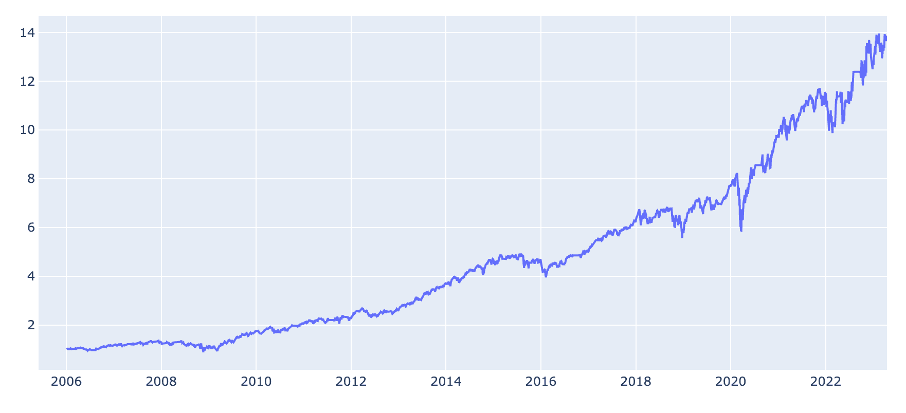

# U.S. Bureau of Labor Statistics (BLS Data)

The [U.S. Bureau of Labor Statistics](https://www.bls.gov) is the principal agency for the U.S. government in the field
of labor economics and statistics.

It provides macroeconomic data in several interesting categories:

- prices,
- employment and unemployment,
- compensation and working conditions and productivity.

Quantiacs has implemented these datasets on its cloud and makes them also available for local use on your machine. For
more information on using the Quantiacs toolbox and datasets offline, please read
our [instructions](https://quantiacs.com/documentation/en/user_guide/local_development.html) on local installation.

```python
import pandas as pd
import qnt.data as qndata

dbs = qndata.blsgov.load_db_list()
display(pd.DataFrame(dbs))
```

| No. | ID  | Full Name                                                                     |
|-----|-----|-------------------------------------------------------------------------------|
| 0   | EN  | Quarterly Census of Employment and Wages                                      |
| 1   | CS  | Nonfatal cases involving days away from work: Selected characteristics        |
| 2   | OE  | Occupational Employment Statistics                                            |
| 3   | FM  | Marital and family labor force statistics from the Current Population Survey  |
| 4   | TU  | American Time Use Survey                                                      |
| 5   | EP  | Employment Projections by Industry                                            |
| 6   | NB  | National Compensation Survey - Benefits                                       |
| 7   | CX  | Consumer Expenditure Survey                                                   |
| 8   | IS  | Occupational injuries and illnesses industry data                             |
| 9   | OR  | Occupational Requirements Survey                                              |
| 10  | MP  | Major Sector Multifactor Productivity                                         |
| 11  | WM  | Wage Modeling                                                                 |
| 12  | CM  | Employer Costs for Employee Compensation                                      |
| 13  | FW  | Census of Fatal Occupational Injuries (2011 forward)                          |
| 14  | IP  | Industry Productivity                                                         |
| 15  | WS  | Work Stoppage Data                                                            |
| 16  | AP  | Consumer Price Index - Average Price Data                                     |
| 17  | CU  | Consumer Price Index - All Urban Consumers                                    |
| 18  | CW  | Consumer Price Index - Urban Wage Earners and Clerical Workers                |
| 19  | SU  | Consumer Price Index - Chained Consumer Price Index for All Urban Consumers   |
| 20  | EI  | Import/Export Price Indexes                                                   |
| 21  | ND  | Producer Price Index Industry Data                                            |
| 22  | PC  | Producer Price Index Industry Data                                            |
| 23  | WD  | Producer Price Index Commodity-Discontinued Series                            |
| 24  | WP  | Producer Price Index-Commodities                                              |
| 25  | LE  | Weekly and hourly earnings data from the Current Population Survey            |
| 26  | LU  | Union affiliation data from the Current Population Survey                     |
| 27  | SM  | State and Area Employment, Hours, and Earnings                                |
| 28  | BD  | Business Employment Dynamics                                                  |
| 29  | CI  | Employment Cost Index                                                         |
| 30  | JT  | Job Openings and Labor Turnover Survey                                        |
| 31  | LA  | Local Area Unemployment Statistics                                            |
| 32  | PR  | Major Sector Productivity and Costs                                           |
| 33  | CE  | Employment, Hours, and Earnings from the Current Employment Statistics survey |
| 34  | LN  | Labor Force Statistics from the Current Population Survey                     |

For each dataset an identifier, the name and the date of the last available update are displayed. Each dataset contains
several time series which can be used as indicators. For example let us consider AP, Average consumer Prices. They are
calculated for household fuel, motor fuel and food items from prices collected for defining the Consumer Price Index.

The time series contained in the AP dataset can be displayed using:

```python
import pandas as pd
import qnt.data as qndata

dataset_name = 'AP'
blsgov_series = list(qndata.blsgov.load_series_list(dataset_name))
metadata = qndata.blsgov.load_db_meta(dataset_name)

for series in blsgov_series:
    series['area_code'] = metadata['area'][series['area_code']]
    series['begin_period'] = metadata['period'][series['begin_period']]['period_name']
    series['end_period'] = metadata['period'][series['end_period']]['period_name']

df = pd.DataFrame(blsgov_series).set_index('id')
df.drop(columns=['footnote_codes'], inplace=True)
display(df)
```

| id            | area_code         | item_code | series_title                                      | begin_year | begin_period | end_year | end_period |
|---------------|-------------------|-----------|---------------------------------------------------|------------|--------------|----------|------------|
| APU0000701111 | U.S. city average | 701111    | Flour, white, all purpose, per lb. (453.6 gm) ... | 1980       | January      | 2022     | December   |
| APU0000701311 | U.S. city average | 701311    | Rice, white, long grain, precooked (cost per p... | 1980       | January      | 1981     | December   |
| APU0000701312 | U.S. city average | 701312    | Rice, white, long grain, uncooked, per lb. (45... | 1980       | January      | 2022     | December   |
| APU0000701321 | U.S. city average | 701321    | Spaghetti (cost per pound/453.6 grams) in U.S.... | 1980       | January      | 1981     | March      |
| APU0000701322 | U.S. city average | 701322    | Spaghetti and macaroni, per lb. (453.6 gm) in ... | 1984       | January      | 2022     | December   |
| ...           | ...               | ...       | ...                                               | ...        | ...          | ...      | ...        |
| APUS49G74713  | Urban Alaska      | 74713     | Gasoline, leaded premium (cost per gallon/3.8 ... | 1978       | January      | 1981     | April      |
| APUS49G74714  | Urban Alaska      | 74714     | Gasoline, unleaded regular, per gallon/3.785 l... | 1978       | January      | 2022     | December   |
| APUS49G74715  | Urban Alaska      | 74715     | Gasoline, unleaded midgrade, per gallon/3.785 ... | 2021       | June         | 2022     | December   |
| APUS49G74716  | Urban Alaska      | 74716     | Gasoline, unleaded premium, per gallon/3.785 l... | 1981       | September    | 2022     | December   |
| APUS49G7471A  | Urban Alaska      | 7471A     | Gasoline, all types, per gallon/3.785 liters i... | 1978       | January      | 2022     | December   |

For AP Consumer Price Index - Average Price Data available:

| Code   | Description                                                                              |
|--------|------------------------------------------------------------------------------------------|
| 701111 | Flour, white, all purpose, per lb. (453.6 gm)                                            | 
| 701311 | Rice, white, long grain, precooked (cost per pound/453.6 grams)                          | 
| 701312 | Rice, white, long grain, uncooked, per lb. (453.6 gm)                                    | 
| 701321 | Spaghetti (cost per pound/453.6 grams)                                                   | 
| 701322 | Spaghetti and macaroni, per lb. (453.6 gm)                                               | 
| 702111 | Bread, white, pan, per lb. (453.6 gm)                                                    | 
| 702112 | Bread, French, per lb. (453.6 gm)                                                        | 
| 702211 | Bread, rye, pan (cost per pound/453.6 grams)                                             | 
| 702212 | Bread, whole wheat, pan, per lb. (453.6 gm)                                              | 
| 702213 | Bread, wheat blend, pan (cost per pound/453.6 grams)                                     | 
| 702221 | Rolls, hamburger (cost per pound/453.6 grams)                                            | 
| 702411 | Cupcakes, chocolate (cost per pound/453.6 grams)                                         | 
| 702421 | Cookies, chocolate chip, per lb. (453.6 gm)                                              | 
| 702611 | Crackers, soda, salted, per lb. (453.6 gm)                                               | 
| 703111 | Ground chuck, 100% beef, per lb. (453.6 gm)                                              | 
| 703112 | Ground beef, 100% beef, per lb. (453.6 gm)                                               | 
| 703113 | Ground beef, lean and extra lean, per lb. (453.6 gm)                                     | 
| 703211 | Chuck roast, USDA Choice, bone-in, per lb. (453.6 gm)                                    | 
| 703212 | Chuck roast, graded and ungraded, excluding USDA Prime and Choice, per lb. (453.6 gm)    | 
| 703213 | Chuck roast, USDA Choice, boneless, per lb. (453.6 gm)                                   | 
| 703311 | Round roast, USDA Choice, boneless, per lb. (453.6 gm)                                   | 
| 703312 | Round roast, graded and ungraded, excluding USDA Prime and Choice, per lb. (453.6 gm)    | 
| 703411 | Rib roast, USDA Choice, bone-in, per lb. (453.6 gm)                                      | 
| 703421 | Steak, chuck, U.S. choice, bone-in (cost per pound/453.6 grams)                          | 
| 703422 | Steak, T-Bone, USDA Choice, bone-in, per lb. (453.6 gm)                                  | 
| 703423 | Steak, porterhouse, U.S. choice, bone-in (cost per pound/453.6 grams)                    | 
| 703425 | Steak, rib eye, USDA Choice, boneless, per lb. (453.6 gm)                                | 
| 703431 | Short ribs, any primal source, bone-in, per lb. (453.6 gm)                               | 
| 703432 | Beef for stew, boneless, per lb. (453.6 gm)                                              | 
| 703511 | Steak, round, USDA Choice, boneless, per lb. (453.6 gm)                                  | 
| 703512 | Steak, round, graded and ungraded, excluding USDA Prime and Choice, per lb. (453.6 gm)   | 
| 703611 | Steak, sirloin, USDA Choice, bone-in, per lb. (453.6 gm)                                 | 
| 703612 | Steak, sirloin, graded and ungraded, excluding USDA Prime and Choice, per lb. (453.6 gm) | 
| 703613 | Steak, sirloin, USDA Choice, boneless, per lb. (453.6 gm)                                | 
| 704111 | Bacon, sliced, per lb. (453.6 gm)                                                        | 
| 704211 | Chops, center cut, bone-in, per lb. (453.6 gm)                                           | 
| 704212 | Chops, boneless, per lb. (453.6 gm)                                                      | 
| 704311 | Ham, rump or shank half, bone-in, smoked,per lb. (453.6 gm)                              | 
| 704312 | Ham, boneless, excluding canned, per lb. (453.6 gm)                                      | 
| 704313 | Ham, rump portion, bone-in, smoked (cost per pound/453.6 grams)                          | 
| 704314 | Ham, shank portion, bone-in, smoked (cost per pound/453.6 grams)                         | 
| 704321 | Ham, canned, 3 or 5 lbs, per lb. (453.6 gm)                                              | 
| 704411 | Pork shoulder roast, blade boston, bone-in (cost per pound/453.6 grams)                  | 
| 704412 | Pork sirloin roast, bone-in (cost per pound/453.6 grams)                                 | 
| 704413 | Shoulder picnic, bone-in, smoked, per lb. (453.6 gm)                                     | 
| 704421 | Sausage, fresh, loose, per lb. (453.6 gm)                                                | 
| 705111 | Frankfurters, all meat or all beef, per lb. (453.6 gm)                                   | 
| 705121 | Bologna, all beef or mixed, per lb. (453.6 gm)                                           | 
| 705141 | Beef liver (cost per pound/453.6 grams)                                                  | 
| 705142 | Lamb and mutton, bone-in, per lb. (453.6 gm)                                             | 
| 706111 | Chicken, fresh, whole, per lb. (453.6 gm)                                                | 
| 706211 | Chicken breast, bone-in, per lb. (453.6 gm)                                              | 
| 706212 | Chicken legs, bone-in, per lb. (453.6 gm)                                                | 
| 706311 | Turkey, frozen, whole, per lb. (453.6 gm)                                                | 
| 707111 | Tuna, light, chunk, per lb. (453.6 gm)                                                   | 
| 708111 | Eggs, grade A, large, per doz.                                                           | 
| 708112 | Eggs, grade AA, large, per doz.                                                          | 
| 709111 | Milk, fresh, whole, fortified, per 1/2 gal. (1.9 lit)                                    | 
| 709112 | Milk, fresh, whole, fortified, per gal. (3.8 lit)                                        | 
| 709211 | Milk, fresh, skim (cost per one-half gallon/1.9 liters)                                  | 
| 709212 | Milk, fresh, low fat, per 1/2 gal. (1.9 lit)                                             | 
| 709213 | Milk, fresh, low fat, per gal. (3.8 lit)                                                 | 
| 710111 | Butter, salted, grade AA, stick, per lb. (453.6 gm)                                      | 
| 710122 | Yogurt, natural, fruit flavored, per 8 oz. (226.8 gm)                                    | 
| 710211 | American processed cheese, per lb. (453.6 gm)                                            | 
| 710212 | Cheddar cheese, natural, per lb. (453.6 gm)                                              | 
| 710411 | Ice cream, prepackaged, bulk, regular, per 1/2 gal. (1.9 lit)                            | 
| 711111 | Apples, Red Delicious, per lb. (453.6 gm)                                                | 
| 711211 | Bananas, per lb. (453.6 gm)                                                              | 
| 711311 | Oranges, Navel, per lb. (453.6 gm)                                                       | 
| 711312 | Oranges, Valencia, per lb. (453.6 gm)                                                    | 
| 711411 | Grapefruit, per lb. (453.6 gm)                                                           | 
| 711412 | Lemons, per lb. (453.6 gm)                                                               | 
| 711413 | Pears, Anjou, per lb. (453.6 gm)                                                         | 
| 711414 | Peaches, per lb. (453.6 gm)                                                              | 
| 711415 | Strawberries, dry pint, per 12 oz. (340.2 gm)                                            | 
| 711416 | Grapes, Emperor or Tokay (cost per pound/453.6 grams)                                    | 
| 711417 | Grapes, Thompson Seedless, per lb. (453.6 gm)                                            | 
| 711418 | Cherries, per lb. (453.6 gm)                                                             | 
| 712111 | Potatoes, white (cost per pound/453.6 grams)                                             | 
| 712112 | Potatoes, white, per lb. (453.6 gm)                                                      | 
| 712211 | Lettuce, iceberg, per lb. (453.6 gm)                                                     | 
| 712311 | Tomatoes, field grown, per lb. (453.6 gm)                                                | 
| 712401 | Cabbage, per lb. (453.6 gm)                                                              | 
| 712402 | Celery, per lb. (453.6 gm)                                                               | 
| 712403 | Carrots, short trimmed and topped, per lb. (453.6 gm)                                    | 
| 712404 | Onions, dry yellow, per lb. (453.6 gm)                                                   | 
| 712405 | Onions, green scallions (cost per pound/453.6 grams)                                     | 
| 712406 | Peppers, sweet, per lb. (453.6 gm)                                                       | 
| 712407 | Corn on the cob, per lb. (453.6 gm)                                                      | 
| 712408 | Radishes (cost per pound/453.6 grams)                                                    | 
| 712409 | Cucumbers, per lb. (453.6 gm)                                                            | 
| 712410 | Beans, green, snap (cost per pound/453.6 grams)                                          | 
| 712411 | Mushrooms (cost per pound/453.6 grams)                                                   | 
| 712412 | Broccoli, per lb. (453.6 gm)                                                             | 
| 713111 | Orange juice, frozen concentrate, 12 oz. can, per 16 oz. (473.2 ml)                      | 
| 713311 | Apple Sauce, any variety, all sizes, per lb. (453.6 gm)                                  | 
| 713312 | Peaches, any variety, all sizes, per lb. (453.6 gm)                                      | 
| 714111 | Potatoes, frozen, French fried, per lb. (453.6 gm)                                       | 
| 714221 | Corn, canned, any style, all sizes, per lb. (453.6 gm)                                   | 
| 714231 | Tomatoes, canned, whole, per lb. (453.6 gm)                                              | 
| 714232 | Tomatoes, canned, any type, all sizes,  per lb. (453.6 gm)                               | 
| 714233 | Beans, dried, any type, all sizes, per lb. (453.6 gm)                                    | 
| 715111 | Hard candy, solid (cost per pound/453.6 grams)                                           | 
| 715211 | Sugar, white, all sizes, per lb. (453.6 gm)                                              | 
| 715212 | Sugar, white, 33-80 oz. pkg, per lb. (453.6 gm)                                          | 
| 715311 | Jelly (cost per pound/453.6 grams)                                                       | 
| 716111 | Margarine, vegetable oil blends, stick (cost per pound/453.6 grams)                      | 
| 716113 | Margarine, vegetable oil blends, soft, tubs (cost per pound/453.6 grams)                 | 
| 716114 | Margarine, stick, per lb. (453.6 gm)                                                     | 
| 716116 | Margarine, soft, tubs, per lb. (453.6 gm)                                                | 
| 716121 | Shortening, vegetable oil blends, per lb. (453.6 gm)                                     | 
| 716141 | Peanut butter, creamy, all sizes, per lb. (453.6 gm)                                     | 
| 717111 | Cola, non-diet, return bottles, 6 or 8 pack (cost per 16 ounces/473.2 ml)                | 
| 717112 | Cola, non diet, return bottles, 24-40 ounce (cost per 16 ounces/473.2 ml)                | 
| 717113 | Cola, nondiet, cans, 72 oz. 6 pk., per 16 oz. (473.2 ml)                                 | 
| 717114 | Cola, nondiet, per 2 liters (67.6 oz)                                                    | 
| 717311 | Coffee, 100%, ground roast, all sizes, per lb. (453.6 gm)                                | 
| 717312 | Coffee, 100%, ground roast, 13.1-20 oz. can, per lb. (453.6 gm)                          | 
| 717324 | Coffee, instant, plain, regular, 6.1-14 ounce (cost per 16 ounces/453.6 grams)           | 
| 717325 | Coffee, freeze dried, regular, all sizes (cost per 16 ounces/453.6 grams)                | 
| 717326 | Coffee, freeze dried, decaf., all sizes (cost per 16 ounces/453.6 grams)                 | 
| 717327 | Coffee, instant, plain, regular, all sizes, per lb. (453.6 gm)                           | 
| 717411 | Coffee, instant, plain, 9.1-14 ounce (cost per 16 ounces/453.6 grams)                    | 
| 717412 | Coffee, instant, plain, 3.1-6 ounce (cost per 16 ounces/453.6 grams)                     | 
| 717413 | Coffee, freeze dried, plain, 3.1-9 ounce (cost per 16 ounces/453.6 grams)                | 
| 718311 | Potato chips, per 16 oz.                                                                 | 
| 718631 | Pork and beans, canned (cost per 16 ounces/453.6 grams)                                  | 
| 720111 | Malt beverages, all types, all sizes, any origin, per 16 oz. (473.2 ml)                  | 
| 720211 | Bourbon whiskey, 375 ml-1.75 liter (cost per 25.4 ounces/750 ml)                         | 
| 720221 | Vodka, domestic, 375 ml-1.75 liter (cost per 25.4 ounces/750 ml)                         | 
| 720222 | Vodka, all types, all sizes, any origin, per 1 liter (33.8 oz)                           | 
| 720311 | Wine, red and white table, all sizes, any origin, per 1 liter (33.8 oz)                  | 
| 72511  | Fuel oil #2 per gallon (3.785 liters)                                                    | 
| 72601  | Utility (piped) gas - 40 therms                                                          | 
| 72610  | Electricity per KWH                                                                      | 
| 72611  | Utility (piped) gas - 100 therms                                                         | 
| 72620  | Utility (piped) gas per therm                                                            | 
| 72621  | Electricity per 500 KWH                                                                  | 
| 74712  | Gasoline, leaded regular (cost per gallon/3.8 liters)                                    | 
| 74713  | Gasoline, leaded premium (cost per gallon/3.8 liters)                                    | 
| 74714  | Gasoline, unleaded regular, per gallon/3.785 liters                                      | 
| 74715  | Gasoline, unleaded midgrade, per gallon/3.785 liters                                     | 
| 74716  | Gasoline, unleaded premium, per gallon/3.785 liters                                      | 
| 74717  | Automotive diesel fuel, per gallon/3.785 liters                                          | 
| 7471A  | Gasoline, all types, per gallon/3.785 liters                                             | 
| FC1101 | All uncooked ground beef, per lb. (453.6 gm)                                             | 
| FC2101 | All Uncooked Beef Roasts, per lb. (453.6 gm)                                             | 
| FC3101 | All Uncooked Beef Steaks, per lb. (453.6 gm)                                             | 
| FC4101 | All Uncooked Other Beef (Excluding Veal), per lb. (453.6 gm)                             | 
| FD2101 | All Ham (Excluding Canned Ham and Luncheon Slices), per lb. (453.6 gm)                   | 
| FD3101 | All Pork Chops, per lb. (453.6 gm)                                                       | 
| FD4101 | All Other Pork (Excluding Canned Ham and Luncheon Slices), per lb. (453.6 gm)            | 
| FF1101 | Chicken breast, boneless, per lb. (453.6 gm)                                             | 
| FJ1101 | Milk, fresh, low-fat, reduced fat, skim, per gal. (3.8 lit)                              | 
| FJ4101 | Yogurt, per 8 oz. (226.8 gm)                                                             | 
| FL2101 | Lettuce, romaine, per lb. (453.6 gm)                                                     | 
| FN1101 | All soft drinks, per 2 liters (67.6 oz)                                                  | 
| FN1102 | All soft drinks, 12 pk, 12 oz., cans, per 12 oz. (354.9 ml)                              | 
| FS1101 | Butter, stick, per lb. (453.6 gm)                                                        |

> Examples

- [Futures - BLS Macro Data](https://github.com/quantiacs/strategy-futures-bls/blob/master/strategy.ipynb) This template
  uses data from the Bureau of Labor Statistics for trading futures contracts.

> This strategy leverages BLS data on flour prices and uses EMA and TRIX indicators to identify trends, generating
> position weights for Nasdaq 100 stock

```python
from IPython.display import display
import xarray as xr
import pandas as pd

import qnt.data as qndata
import qnt.output as qnout
import qnt.ta as qnta
import qnt.stats as qns


# Function to generate the strategy weights
def get_strategy(data, data_bls, params):
    ema_ = qnta.ema(data_bls, params[0])
    trix_ = qnta.trix(data_bls, 14)
    weight_1 = trix_.shift(time=params[1]) > trix_.shift(time=params[2])
    weight_2 = ema_.shift(time=params[3]) > ema_.shift(time=params[4])
    weights = (weight_1 + weight_2) * data.sel(field="is_liquid")
    return weights.fillna(0)


# Function to load BLS data and convert it to xarray
def get_bls_xr(blsgov_ticker):
    ap = qndata.blsgov.load_series_data(blsgov_ticker, min_date="2005-06-01")

    # Convert the loaded BLS data to a pandas DataFrame
    ap = pd.DataFrame(ap)
    ap = ap.set_index('pub_date')

    # Remove yearly average data
    ap = ap[ap['period'] != 'M13']

    # Convert the DataFrame to an xarray
    ap = ap['value'].to_xarray().rename(pub_date='time').assign_coords(time=pd.to_datetime(ap.index.values))
    return ap


# Function to align BLS data with the stocks data
def get_align_bls_index(bls, data):
    align = xr.align(bls, data.isel(field=0), join='outer')[0]
    align = align.ffill(dim="time")
    align = xr.align(align, data.isel(field=0), join='right')[0]
    return align


# Load stock data
data = qndata.stocks.load_ndx_data(min_date="2005-06-01")

# Load BLS data for the specified ticker
# AP : Consumer Price Index - Average Price Data
# APU0000701111 = U.S. city , average Flour, white, all purpose, per lb. (453.6 gm) ...

bls_data = get_bls_xr('APU0000701111')

# Align the BLS data with the stock data
aligned_data = get_align_bls_index(bls_data, data)

# Generate strategy weights
weights = get_strategy(data, aligned_data, [55, 44, 11, 63, 44])

```

to participate in the competition

```python

def get_enough_bid_for(data, weights_):
    time_traded = weights_.time[abs(weights_).fillna(0).sum('asset') > 0]
    is_strategy_traded = len(time_traded)
    if is_strategy_traded:
        return xr.where(weights_.time < time_traded.min(), data.sel(field="is_liquid"), weights_)
    return weights_


weights_new = get_enough_bid_for(data, weights)
weights_new = weights_new.sel(time=slice("2006-01-01", None))
weights = qnout.clean(output=weights_new, data=data, kind="stocks_nasdaq100")


def print_statistic(data, weights_all):
    import plotly.graph_objs as go
    import qnt.stats as qnstats

    stats = qnstats.calc_stat(data, weights_all)
    display(stats.to_pandas().tail(5))

    equity_curve = stats.loc[:, "equity"]
    fig = go.Figure(data=[
        go.Scatter(
            x=equity_curve.time.to_pandas(),
            y=equity_curve,
            hovertext="Equity curve",
        )
    ])
    fig.update_yaxes(fixedrange=False)
    fig.show()


print_statistic(data, weights)

qnout.check(weights, data, "stocks_nasdaq100")
qnout.write(weights)  # to participate in the competition

```

| time       | equity    | relative_return | volatility | underwater | max_drawdown | sharpe_ratio | mean_return | bias | instruments | avg_turnover | avg_holding_time |
|------------|-----------|-----------------|------------|------------|--------------|--------------|-------------|------|-------------|--------------|------------------|
| 2023-04-12 | 13.644812 | -0.008994       | 0.198034   | -0.022339  | -0.34963     | 0.825595     | 0.163496    | 1.0  | 236.0       | 0.033574     | 90.762023        |
| 2023-04-13 | 13.822178 | 0.012999        | 0.198034   | -0.009631  | -0.34963     | 0.829790     | 0.164326    | 1.0  | 236.0       | 0.033572     | 90.762023        |
| 2023-04-14 | 13.761683 | -0.004377       | 0.198015   | -0.013965  | -0.34963     | 0.828171     | 0.163990    | 1.0  | 236.0       | 0.033567     | 90.762023        |
| 2023-04-17 | 13.807748 | 0.003347        | 0.197993   | -0.010665  | -0.34963     | 0.829194     | 0.164175    | 1.0  | 236.0       | 0.033562     | 90.762023        |
| 2023-04-18 | 13.805930 | -0.000132       | 0.197970   | -0.010795  | -0.34963     | 0.829039     | 0.164125    | 1.0  | 236.0       | 0.033558     | 89.774388        |

