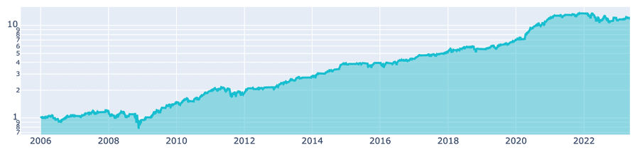

# International Monetary Fund (IMF)

The [International Monetary Fund (IMF)](https://www.imf.org) publishes a range of time series data on IMF lending,
exchange rates and other economic and financial indicators.

- [IMF Commodity Data](#imf-commodity-data)
- [IMF Currency Data](#imf-currency-data)

## IMF Commodity Data

```python
import pandas as pd
import qnt.data as qndata

commodity_list = qndata.imf_load_commodity_list()
# imf_commodity = qndata.imf_load_commodity_data(min_date="2005-06-01")
display(pd.DataFrame(commodity_list))
```

| N   | ID        | Name                                               | Full Name                                                                    |
|-----|-----------|----------------------------------------------------|------------------------------------------------------------------------------|
| 1   | LMICS     | Low and Middle Income Commodity Index (World Bank) | Primary Commodity Prices, Low and Middle Income Commodity Index (World Bank) | 
| 2   | PALUM     | Aluminum                                           | Primary Commodity Prices, Aluminum                                           | 
| 3   | PAPPLE    | Non-Citrus Fruit, Apple                            | Primary Commodity Prices, Non-Citrus Fruit, Apple                            | 
| 4   | PBANSOP   | Bananas                                            | Primary Commodity Prices, Bananas                                            | 
| 5   | PBARL     | Barley                                             | Primary Commodity Prices, Barley                                             | 
| 6   | PBEEF     | Beef                                               | Primary Commodity Prices, Beef                                               | 
| 7   | PCHANA    | Legumes, Chickpea                                  | Primary Commodity Prices, Legumes, Chickpea                                  | 
| 8   | PCHROM    | Chromium                                           | Primary Commodity Prices, Chromium                                           | 
| 9   | PCOALAU   | Coal, Australia                                    | Primary Commodity Prices, Coal, Australia                                    | 
| 10  | PCOALSA   | Coal, South Africa                                 | Primary Commodity Prices, Coal, South Africa                                 | 
| 11  | PCOBA     | Cobalt                                             | Primary Commodity Prices, Cobalt                                             | 
| 12  | PCOCO     | Cocoa                                              | Primary Commodity Prices, Cocoa                                              | 
| 13  | PCOFFOTM  | Coffee, Other Mild Arabica                         | Primary Commodity Prices, Coffee, Other Mild Arabica                         | 
| 14  | PCOFFROB  | Coffee, Robustas                                   | Primary Commodity Prices, Coffee, Robustas                                   | 
| 15  | PCOIL     | Coconut Oil                                        | Primary Commodity Prices, Coconut Oil                                        | 
| 16  | PCOPP     | Copper                                             | Primary Commodity Prices, Copper                                             | 
| 17  | PCOTTIND  | Cotton                                             | Primary Commodity Prices, Cotton                                             | 
| 18  | PDAP      | Diammonium phosphate                               | Primary Commodity Prices, Diammonium phosphate                               | 
| 19  | PFSHMEAL  | Fish Meal                                          | Primary Commodity Prices, Fish Meal                                          | 
| 20  | PGASO     | Gasoline                                           | Primary Commodity Prices, Gasoline                                           | 
| 21  | PGNUTS    | Groundnuts                                         | Primary Commodity Prices, Groundnuts                                         | 
| 22  | PGOLD     | Gold                                               | Primary Commodity Prices, Gold                                               | 
| 23  | PHEATOIL  | Heating Oil                                        | Primary Commodity Prices, Heating Oil                                        | 
| 24  | PHIDE     | Hides                                              | Primary Commodity Prices, Hides                                              | 
| 25  | PIORECR   | Iron Ore                                           | Primary Commodity Prices, Iron Ore                                           | 
| 26  | PLAMB     | Lamb                                               | Primary Commodity Prices, Lamb                                               | 
| 27  | PLEAD     | Lead                                               | Primary Commodity Prices, Lead                                               | 
| 28  | PLITH     | Lithium                                            | Primary Commodity Prices, Lithium                                            | 
| 29  | PLMMODY   | Molybdenum                                         | Primary Commodity Prices, Molybdenum                                         | 
| 30  | PLOGORE   | Soft Logs                                          | Primary Commodity Prices, Soft Logs                                          | 
| 31  | PLOGSK    | Hard Logs, Import Price Japan                      | Primary Commodity Prices, Hard Logs, Import Price Japan                      | 
| 32  | PMAIZMT   | Corn                                               | Primary Commodity Prices, Corn                                               | 
| 33  | PMANGELE  | Manganese                                          | Primary Commodity Prices, Manganese                                          | 
| 34  | PMILK     | Dairy Products, Milk                               | Primary Commodity Prices, Dairy Products, Milk                               | 
| 35  | PNGASEU   | Natural gas, EU                                    | Primary Commodity Prices, Natural gas, EU                                    | 
| 36  | PNGASJP   | LNG, Asia                                          | Primary Commodity Prices, LNG, Asia                                          | 
| 37  | PNGASUS   | Natural Gas, US Henry Hub Gas                      | Primary Commodity Prices, Natural Gas, US Henry Hub Gas                      | 
| 38  | PNICK     | Nickel                                             | Primary Commodity Prices, Nickel                                             | 
| 39  | POATS     | Oats                                               | Primary Commodity Prices, Oats                                               | 
| 40  | POILAPSP  | APSP crude oil($/bbl)                              | Primary Commodity Prices, APSP crude oil($/bbl)                              | 
| 41  | POILBRE   | Brent Crude                                        | Primary Commodity Prices, Brent Crude                                        | 
| 42  | POILDUB   | Dubai Crude                                        | Primary Commodity Prices, Dubai Crude                                        | 
| 43  | POILWTI   | WTI Crude                                          | Primary Commodity Prices, WTI Crude                                          | 
| 44  | POLVOIL   | Olive Oil                                          | Primary Commodity Prices, Olive Oil                                          | 
| 45  | PORANG    | Orange                                             | Primary Commodity Prices, Orange                                             | 
| 46  | PPALLA    | Palladium                                          | Primary Commodity Prices, Palladium                                          | 
| 47  | PPLAT     | Platinum                                           | Primary Commodity Prices, Platinum                                           | 
| 48  | PPOIL     | Palm Oil                                           | Primary Commodity Prices, Palm Oil                                           | 
| 49  | PPORK     | Swine                                              | Primary Commodity Prices, Swine                                              | 
| 50  | PPOTASH   | Potassium Fertilizer                               | Primary Commodity Prices, Potassium Fertilizer                               | 
| 51  | PPOULT    | Poultry                                            | Primary Commodity Prices, Poultry                                            | 
| 52  | PPROPANE  | Propane                                            | Primary Commodity Prices, Propane                                            | 
| 53  | PREODOM   | Rare Earth Elements                                | Primary Commodity Prices, Rare Earth Elements                                | 
| 54  | PRICENPQ  | Rice, Thailand                                     | Primary Commodity Prices, Rice, Thailand                                     | 
| 55  | PROIL     | Rapeseed Oil                                       | Primary Commodity Prices, Rapeseed Oil                                       | 
| 56  | PRUBB     | Rubber                                             | Primary Commodity Prices, Rubber                                             | 
| 57  | PSALM     | Fish                                               | Primary Commodity Prices, Fish                                               | 
| 58  | PSAWMAL   | Hard Sawnwood, Dark Red Meranti                    | Primary Commodity Prices, Hard Sawnwood, Dark Red Meranti                    | 
| 59  | PSAWORE   | Soft Sawnwood, Average of Softwoods,               | Primary Commodity Prices, Soft Sawnwood, Average of Softwoods,               | 
| 60  | PSHRI     | Shrimp                                             | Primary Commodity Prices, Shrimp                                             | 
| 61  | PSILLUMP  | Silicon                                            | Primary Commodity Prices, Silicon                                            | 
| 62  | PSILVER   | Silver                                             | Primary Commodity Prices, Silver                                             | 
| 63  | PSMEA     | Soybean Meal                                       | Primary Commodity Prices, Soybean Meal                                       | 
| 64  | PSOIL     | Soybeans Oil                                       | Primary Commodity Prices, Soybeans Oil                                       | 
| 65  | PSORG     | Sorghum                                            | Primary Commodity Prices, Sorghum                                            | 
| 66  | PSOYB     | Soybeans                                           | Primary Commodity Prices, Soybeans                                           | 
| 67  | PSUGAISA  | Sugar, No. 11, World                               | Primary Commodity Prices, Sugar, No. 11, World                               | 
| 68  | PSUGAUSA  | Sugar, No. 16, US                                  | Primary Commodity Prices, Sugar, No. 16, US                                  | 
| 69  | PSUNO     | Sunflower Oil                                      | Primary Commodity Prices, Sunflower Oil                                      | 
| 70  | PTEA      | Tea, Kenyan                                        | Primary Commodity Prices, Tea, Kenyan                                        | 
| 71  | PTEAINDIA | Tea, Kolkata                                       | Primary Commodity Prices, Tea, Kolkata                                       | 
| 72  | PTEAMOM   | Tea, Mombasa                                       | Primary Commodity Prices, Tea, Mombasa                                       | 
| 73  | PTEASL    | Tea, Colombo                                       | Primary Commodity Prices, Tea, Colombo                                       | 
| 74  | PTIN      | Tin                                                | Primary Commodity Prices, Tin                                                | 
| 75  | PTOMATO   | Vegetables, Tomato                                 | Primary Commodity Prices, Vegetables, Tomato                                 | 
| 76  | PURAN     | Uranium                                            | Primary Commodity Prices, Uranium                                            | 
| 77  | PUREA     | Urea                                               | Primary Commodity Prices, Urea                                               | 
| 78  | PVANPENT  | Vanadium                                           | Primary Commodity Prices, Vanadium                                           | 
| 79  | PWHEAMT   | Wheat                                              | Primary Commodity Prices, Wheat                                              | 
| 80  | PWOOLC    | Wool, Coarse                                       | Primary Commodity Prices, Wool, Coarse                                       | 
| 81  | PWOOLF    | Wool, Fine                                         | Primary Commodity Prices, Wool, Fine                                         | 
| 82  | PZINC     | Zinc                                               | Primary Commodity Prices, Zinc                                               | 

### Examples

- [Futures - Using IMF Commodity Data](https://github.com/quantiacs/strategy-futures-commodity/blob/master/strategy.ipynb)
  This template uses external commodity International Monetary Fund data for creating an algorithm for futures
  contracts.
- [Machine Learning - predict futures BTC use IMF Commodity Data](https://github.com/quantiacs/strategy-ml-predict-BTC-use-IMF/blob/master/strategy.ipynb)
  Strategy idea: We will open crypto futures BTC positions as predicted by the RidgeClassifier.

> This strategy leverages IMF data on Gold prices and uses EMA and TRIX indicators to identify trends, generating
> position weights for Nasdaq 100 stock

```python
from IPython.display import display
import xarray as xr
import pandas as pd

import qnt.data as qndata
import qnt.output as qnout
import qnt.ta as qnta
import qnt.stats as qnstats


def calculate_weights(data, data_imf, params):
    """Function to generate the strategy weights"""
    ema_ = qnta.ema(data_imf, params[0])
    trix_ = qnta.trix(data_imf, 14)
    weight_1 = trix_.shift(time=params[1]) > trix_.shift(time=params[2])
    weight_2 = ema_.shift(time=params[3]) > ema_.shift(time=params[4])
    weights = (weight_1 + weight_2) * data.sel(field="is_liquid")
    return weights.fillna(0)


def get_align_imf_index(imf, data):
    """Function to align IMF data with the stocks data"""
    align = xr.align(imf, data.isel(field=0), join='outer')[0]
    align = align.ffill(dim="time")  # Forward fill any missing data
    # Align again to ensure all dates match the stock data
    align = xr.align(align, data.isel(field=0), join='right')[0]
    return align


min_date = "2005-06-01"  # Minimum date for data retrieval
commodity_name = 'PGOLD'  # Commodity name for IMF data - Gold

data = qndata.stocks.load_ndx_data(min_date=min_date)
imf_commodity = qndata.imf_load_commodity_data(assets=[commodity_name], min_date=min_date)
aligned_data = get_align_imf_index(imf_commodity.sel(asset=commodity_name), data)
weights = calculate_weights(data, aligned_data, [18, 69, 22, 40, 97])


# to participate in the competition

def add_buy_and_hold_enough_bid_for(data, weights_):
    """Add buy and hold condition based on the liquidity of the assets."""
    time_traded = weights_.time[abs(weights_).fillna(0).sum('asset') > 0]
    is_strategy_traded = len(time_traded)
    if is_strategy_traded:
        return xr.where(weights_.time < time_traded.min(), data.sel(field="is_liquid"), weights_)
    return weights_


def plot_performance(stats):
    """Plot the performance of the strategy."""
    performance = stats.to_pandas()["equity"]
    import qnt.graph as qngraph
    qngraph.make_plot_filled(performance.index, performance, name="PnL (Equity)", type="log")


weights_new = add_buy_and_hold_enough_bid_for(data, weights)
weights_new = weights_new.sel(time=slice("2006-01-01", None))
weights = qnout.clean(output=weights_new, data=data, kind="stocks_nasdaq100")

stats = qnstats.calc_stat(data, weights.sel(time=slice("2006-01-01", None)))
display(stats.to_pandas().tail())

plot_performance(stats)

qnout.check(weights, data, "stocks_nasdaq100")
qnout.write(weights)  # to participate in the competition

```

| Time       | Equity  | Relative Return | Volatility | Underwater | Max Drawdown | Sharpe Ratio | Mean Return | Bias | Instruments | Avg Turnover | Avg Holding Time |
|------------|---------|-----------------|------------|------------|--------------|--------------|-------------|------|-------------|--------------|------------------|
| 2023-05-05 | 12.043  | 0.016           | 0.185      | -0.123     | -0.381       | 0.835        | 0.154       | 1.0  | 236.0       | 0.029        | 85.875           |
| 2023-05-08 | 12.073  | 0.002           | 0.185      | -0.121     | -0.381       | 0.836        | 0.155       | 1.0  | 236.0       | 0.029        | 85.875           |
| 2023-05-09 | 11.991  | -0.007          | 0.185      | -0.127     | -0.381       | 0.833        | 0.154       | 1.0  | 236.0       | 0.029        | 85.875           |
| 2023-05-10 | 12.061  | 0.006           | 0.185      | -0.122     | -0.381       | 0.835        | 0.154       | 1.0  | 236.0       | 0.029        | 85.875           |
| 2023-05-11 | 12.048  | -0.001          | 0.185      | -0.123     | -0.381       | 0.835        | 0.154       | 1.0  | 236.0       | 0.029        | 84.914           |



## IMF Currency Data

```python
import pandas as pd
import qnt.data as qndata

currency_list = qndata.imf_load_currency_list()
# imf_currency = qndata.imf_load_currency_data(min_date="2005-06-01")
display(pd.DataFrame(currency_list))
```

|     | ID  | Currency            |
|-----|-----|---------------------|
| 0   | AED | U.A.E. dirham       |
| 1   | AUD | Australian dollar   |
| 2   | BND | Brunei dollar       |
| 3   | BRL | Brazilian real      |
| 4   | BWP | Botswana pula       |
| 5   | CAD | Canadian dollar     |
| 6   | CHF | Swiss franc         |
| 7   | CLP | Chilean peso        |
| 8   | CNY | Chinese yuan        |
| 9   | COP | Colombian peso      |
| 10  | CZK | Czech koruna        |
| 11  | DKK | Danish krone        |
| 12  | DZD | Algerian dinar      |
| 13  | EUR | Euro                |
| 14  | GBP | U.K. pound          |
| 15  | ILS | Israeli New Shekel  |
| 16  | INR | Indian rupee        |
| 17  | JPY | Japanese yen        |
| 18  | KRW | Korean won          |
| 19  | KWD | Kuwaiti dinar       |
| 20  | MUR | Mauritian rupee     |
| 21  | MXN | Mexican peso        |
| 22  | MYR | Malaysian ringgit   |
| 23  | NOK | Norwegian krone     |
| 24  | NZD | New Zealand dollar  |
| 25  | OMR | Omani rial          |
| 26  | PEN | Peruvian sol        |
| 27  | PHP | Philippine peso     |
| 28  | PLN | Polish zloty        |
| 29  | QAR | Qatari riyal        |
| 30  | RUB | Russian ruble       |
| 31  | SAR | Saudi Arabian riyal |
| 32  | SEK | Swedish krona       |
| 33  | SGD | Singapore dollar    |
| 34  | THB | Thai baht           |
| 35  | TTD | Trinidadian dollar  |
| 36  | USD | U.S. dollar         |
| 37  | UYU | Uruguayan peso      |
| 38  | ZAR | South African rand  |

### Examples

- [Futures - Using IMF Currency Data](https://github.com/quantiacs/strategy-futures-currency/blob/master/strategy.ipynb)
  This template uses International Monetary Fund currency data and shows an algorithm for futures contracts.

> This strategy leverages IMF data on EUR and uses EMA and TRIX indicators to identify trends, generating
> position weights for Nasdaq 100 stock

```python
from IPython.display import display
import xarray as xr
import pandas as pd

import qnt.data as qndata
import qnt.output as qnout
import qnt.ta as qnta
import qnt.stats as qnstats


def calculate_weights(data, data_imf, params):
    """Function to generate the strategy weights"""
    ema_ = qnta.ema(data_imf, params[0])
    trix_ = qnta.trix(data_imf, 14)
    weight_1 = trix_.shift(time=params[1]) > trix_.shift(time=params[2])
    weight_2 = ema_.shift(time=params[3]) > ema_.shift(time=params[4])
    weights = (weight_1 + weight_2) * data.sel(field="is_liquid")
    return weights.fillna(0)


def get_align_imf_index(imf, data):
    """Function to align IMF data with the stocks data"""
    align = xr.align(imf, data.isel(field=0), join='outer')[0]
    align = align.ffill(dim="time")  # Forward fill any missing data
    # Align again to ensure all dates match the stock data
    align = xr.align(align, data.isel(field=0), join='right')[0]
    return align


min_date = "2005-06-01"  # Minimum date for data retrieval
currency_name = 'EUR'  # Currency name for IMF data - EUR

data = qndata.stocks.load_ndx_data(min_date=min_date)
imf_currency = qndata.imf_load_currency_data(assets=[currency_name], min_date=min_date)
aligned_data = get_align_imf_index(imf_currency.sel(asset=currency_name), data)
weights = calculate_weights(data, aligned_data, [67, 98, 52, 7, 77])


# to participate in the competition

def add_buy_and_hold_enough_bid_for(data, weights_):
    """Add buy and hold condition based on the liquidity of the assets."""
    time_traded = weights_.time[abs(weights_).fillna(0).sum('asset') > 0]
    is_strategy_traded = len(time_traded)
    if is_strategy_traded:
        return xr.where(weights_.time < time_traded.min(), data.sel(field="is_liquid"), weights_)
    return weights_


def plot_performance(stats):
    """Plot the performance of the strategy."""
    performance = stats.to_pandas()["equity"]
    import qnt.graph as qngraph
    qngraph.make_plot_filled(performance.index, performance, name="PnL (Equity)", type="log")


weights_new = add_buy_and_hold_enough_bid_for(data, weights)
weights_new = weights_new.sel(time=slice("2006-01-01", None))
weights = qnout.clean(output=weights_new, data=data, kind="stocks_nasdaq100")

stats = qnstats.calc_stat(data, weights.sel(time=slice("2006-01-01", None)))
display(stats.to_pandas().tail())

plot_performance(stats)

qnout.check(weights, data, "stocks_nasdaq100")
qnout.write(weights)  # to participate in the competition


```