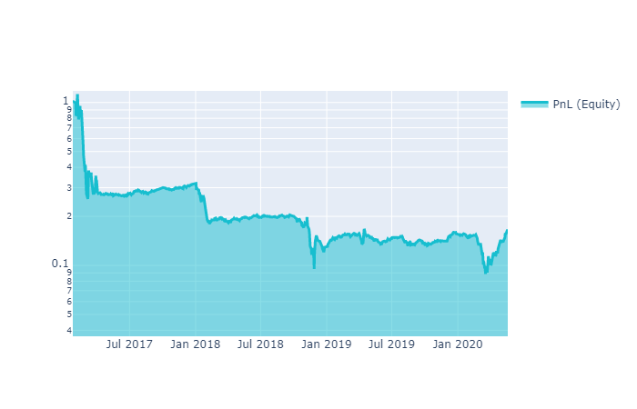

# Стратегия торговли по ценам открытия

Ниже приведены основные шаги, которые могут быть включены в каждую стратегию.
## 1. Подготовка
Сначала нужно подготовить рабочее пространство - загрузить данные и библиотеки
```python
# Import basic libraries.
import xarray as xr
import numpy as np
import pandas as pd

# Import quantiacs libraries.
import qnt.data    as qndata
import qnt.stepper as qnstepper
import qnt.stats   as qnstats
import qnt.graph   as qngraph
import qnt.forward_looking as qnfl # forward looking checking
```
```python
# load historical data
data = qndata.load_data(min_date = "2017-01-01",
                        max_date = None,
                        dims     = ("time", "field", "asset"))
```

" data "- это xarray.DataArray, который содержит исторические данные. Например, 
мы хотим получить цены открытия и закрытия акций Apple:

```python
apple_close = data.loc[::, "close", "NASDAQ:AAPL"]
apple_open = data.loc[::, "open", "NASDAQ:AAPL"]

# you can also work with pandas:
# apple_close = data.loc[::, "close", :].to_pandas()["NASDAQ:AAPL"]
```

Таблицу доступных данных можно посмотреть здесь. Некоторые другие данные:
```python
all_close = data.loc[::, "close", :]
all_open = data.loc[::, "open", :]

# boolean parameter. True if the stock is in top 500 most liquid stocks over the last month
liquid = data.loc[::, "is_liquid", :]
```

## 2. Распределение весов
Предположим, у нас есть торговая идея - инвестировать больше, если цена открытия низкая. 
Эта гипотеза может быть выражена через формулу:

```math
\frac{1}{open}
```

Мы можем распределить капитал, присваивая веса инструментам портфеля. (читать подробнее [здесь](/data/market.md)):
```python
weights = 1/all_open
```

Вы можете реализовать и протестировать любую идею, какую захотите. Некоторые другие примеры:
```python
# buy all positions: weights = all_open/all_open
# sell all positions: weights = -all_open/all_open
# the more price change, the more we buy = (all_close - all_open)/all_open
```

Обратите внимание, что мы торгуем только ликвидными акциями. Можно сформировать выходные веса:

```python
output = weights*liquid


# If you worked with pandas and weigths is pandas.Dataframe:
# output = xr.DataArray(weights.values, dims = ["time","asset"], coords= {"time":weights.index,"asset":weights.columns} )
```


## 3. Оценка эффективности
После того, как мы построили алгоритм, нам нужно его оценить. Для начала нам нужно рассчитать статистику.
```python
# calc_stat calculate statistic on a relevenat time frame window
stat = qnstats.calc_stat(data, output)
display(stat.to_pandas().tail())
```

Результаты алгоритма, рассчитанные на исторических данных, 
обычно представлены на [графике прибыли (equity)](/intro/rr.md) чтобы понять поведение совокупной прибыли:
```python
# show plot with profit and losses:
performance = stat.to_pandas()["equity"]
qngraph.make_plot_filled(performance.index, performance, name="PnL (Equity)", type="log")
```



Мы используем набор [критериев](/quality/rules.md) для оценки производительности. 
Вы можете отправить свой алгоритм и принять участие в соревнованиях, если он пройдет все [фильтры](/quality/major.md).
```python
# Actual sharpe on a relevant timeframe. 
# According to the rules the Sharpe ratio must be greater than 1:
display(stat[-1:].sel(field = ["sharpe_ratio"]).transpose().to_pandas())

# According to the rules the correlation with other strategies must be less than 90%:
qnstats.print_correlation(output, data)
```


## 4. Отправка стратегии

Если вы достаточно удовлетворены своим алгоритмом и он соответствует всем требованиям, вы можете отправить его.
```python
# Finally, write the output
qnstepper.write_output(output)
```

На этом этапе код готов к отправке. Просто нажмите на кнопку отправки на странице вашего аккаунта, 
и мы оценим вашу стратегию на наших серверах!

[СОЗДАТЬ СТРАТЕГИЮ](#)

Не забудьте [зарегистрироваться на платформе](https://quantiacs.io/personalpage/registration)