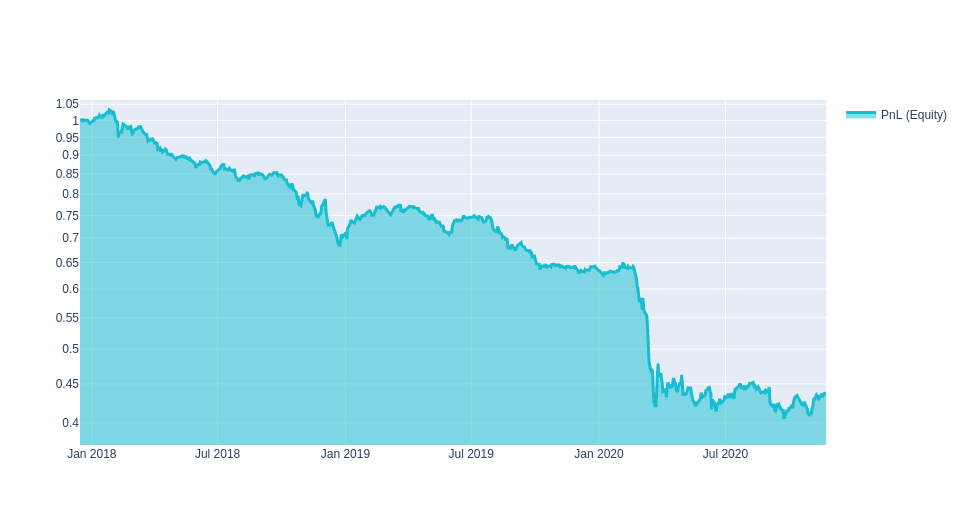

## About the platform

**Quantiacs** hosts quantitative trading contests since 2014 and has allocated more than 30M USD to winning algorithms on futures markets. We are expanding the universe of assets you can use and adding new tools.

> We **offer** to users:
* a space to develop code and test ideas for forecasting global financial markets based on **Jupyter Notebook** and **JupyterLab**;
* support for **Python** and **Scala**;
* the power of the full **Anaconda** data science ecosystem;
* up to free **8 GB of RAM** for each trading strategy;
* access to historical **data** for stocks, futures and cryptocurrencies;
* trading strategy **templates** for getting started;
* **prize money**. Participate to our <a href='/contest' target='_blank'>competitions</a> and take one of the top spots. Winners are receiving 10% of the generated profits without any downside risk.

<p class="tip">Get started with Quantiacs!</p>

* <a class="tip" href='/personalpage/registration' target='_blank'>Register</a> to the platform;
* Open the <a class="tip" href='/personalpage/strategies' target='_blank'> strategy development tab</a>;
* Create a strategy from scratch or clone one of the provided templates;
* Submit strategies and monitor their live performance in your private area.

Below are the main steps involved in most strategies.


## Building strategies

### Example for stocks


> Strategy idea. The current day's price minus the previous day's price for the top 500 liquid instruments. We take the resulting changes as the weights of assets in the portfolio.

```python
import qnt.data as qndata
import qnt.stats as qnstats
import qnt.output as output

data = qndata.stocks.load_data(tail=6 * 365)

price_open = data.sel(field="open")
price_open_one_day_ago = price_open.shift(time=1)

strategy = price_open - price_open_one_day_ago

weights = strategy * data.sel(field="is_liquid")
weights = weights / abs(strategy).sum('asset')
weights = output.clean(weights, data, "stocks")

statistics = qnstats.calc_stat(data, weights)
output.check(weights, data, "stocks")

output.write(weights)
```


### Example for futures


> Strategy idea. The current day's price minus the previous day's price for futures. We take the resulting changes as the weights of assets in the portfolio.

```python
import qnt.data as qndata
import qnt.stats as qnstats
import qnt.output as output
import qnt.ta as qnta

futures = qndata.futures.load_data(min_date="2006-01-01")

price_open = futures.sel(field="open")
price_open_one_day_ago = qnta.shift(price_open, periods=1)

strategy = price_open - price_open_one_day_ago

weights = strategy / abs(strategy).sum('asset')

statistics = qnstats.calc_stat(futures, weights)
output.check(weights, futures, "futures")

output.write(weights)
```

### 1. Preparations

At first one needs to prepare the workspace - load data and libraries

```python
import qnt.data as qndata
import qnt.stats as qnstats
import qnt.output as output
import qnt.ta as qnta

data = qndata.stocks.load_data(tail=6 * 365)
```

**data** is xarray.DataArray that contains **stocks historical data** for the last 6 * 365 days. 
The table of available data can be viewed here.

Get opening prices for today and yesterday:

```python
price_open = data.sel(field="open")
price_open_one_day_ago = qnta.shift(price_open, periods=1)
```

### 2. Weights allocation
> The trading algorithm uses financial data to form the weights, in proportion to which the capital is distributed. 

A **positive** weight means a long position (**buy**), a **negative** value means a short position (**sell**).

<p class="tip">For each date, the algorithm calculates what portfolio weights should be at the opening of the next day's trading.</p>

We will distribute the capital as the **difference** between **prices** for today and yesterday:
```python
strategy = price_open - price_open_one_day_ago
```
We will trade the top 500 **liquid companies**:

```python
weights = strategy * data.sel(field="is_liquid")
```
**data.sel(field = “is_liquid“)** is xarray.DataArray. A value of **1** on a particular day for a particular company means that the stock has been **in the top 500 liquid stocks** for the last full month.

We **normalize** % of capital for all companies:
```python
weights = weights / abs(strategy).sum('asset')
```
Let's try to **remove** the main financial **risks** from the strategy. The function includes **exposure** correction, **neutralization**.
```python
weights = output.clean(weights, data, "stocks")
```
### 3. Performance estimation
After we have built the algorithm, we need to evaluate it. First, we need to **calculate statistics**.

```python
statistics = qnstats.calc_stat(data, weights)
display(statistics.to_pandas().tail())
```

Algorithm results, calculated on historical data, are usually presented on an equity graph in order to understand the behavior of the cumulative profit:

```python
import qnt.graph as qngraph
performance = statistics.to_pandas()["equity"]
qngraph.make_plot_filled(performance.index, performance, name="PnL (Equity)", type="log")
```


### 4. Submit

The function will **show possible problems** that the strategy has
```python
output.check(weights, data, "stocks")
```

If everything is ok, **save** the portfolio **weights** that the algorithm generates

```python
output.write(weights)
```

<p class="tip">To participate in the competition:</p>

* <a class="tip" href='/personalpage/strategies' target='_blank'>open your personal account</a>.
* choose your strategy.
* **click** on the **"Submit"** button.

### Ready for More?

We’ve briefly introduced the most basic features of the Quantiacs platform - the rest of this guide will cover them and other advanced features with much finer details, so make sure to read through it all!
