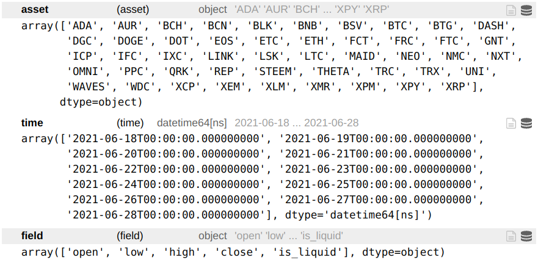

# Data loading

<p class="tip">
This section contains the detailed API reference documentation. It is intended for users who are already familiar with the Quantiacs platform. First-time users can start at the <a href="/documentation/en/quick_start/quick_start.html">Quick start</a> page.
</p>


## Inspecting the list of Futures

The available futures financial instruments can be inspected using the following function:

**Function**

```python
import qnt.data as qndata
qndata.futures.load_list()
```

**Output**

The output is a list of dictionaries with info on ticker symbols and assets:

```python
[{'id': 'F_AE',
  'name': 'AEX Index',
  'sector': 'Index',
  'point_value': 'EUR 200'},
 {'id': 'F_AH',
  'name': 'Bloomberg Commodity',
  'sector': 'Index',
  'point_value': '$250'},
 {'id': 'F_AX',
  'name': 'DAX Index',
  'sector': 'Index',
  'point_value': 'EUR 25'},
 {'id': 'F_BC',
  'name': 'Crude Oil Brent',
  'sector': 'Energy',
  'point_value': '$1,000'},
 {'id': 'F_BG',
  'name': 'ICE Gas Oil LS',
  'sector': 'Energy',
  'point_value': '$100'},
 {'id': 'F_C',
  'name': 'Corn',
  'sector': 'Agriculture',
  'point_value': 'EUR 50'},
 {'id': 'F_CA', 'name': 'CAC 40', 'sector': 'Index', 'point_value': 'EUR 10'},
 {'id': 'F_CC',
  'name': 'Cocoa',
  'sector': 'Agriculture',
  'point_value': '$10'},
 {'id': 'F_CF',
  'name': 'Eurex Conf Long-Term',
  'sector': 'Bond',
  'point_value': 'CHF 1,000'},
 {'id': 'F_CT',
  'name': 'Cotton #2',
  'sector': 'Agriculture',
  'point_value': '$500'},
 {'id': 'F_DE',
  'name': 'MSCI EMI Index',
  'sector': 'Index',
  'point_value': '$50'},
 {'id': 'F_DM',
  'name': 'MDAX Index',
  'sector': 'Index',
  'point_value': 'EUR 5'},
 {'id': 'F_DT',
  'name': 'Euro Bund',
  'sector': 'Bond',
  'point_value': 'EUR 1,000'},
 {'id': 'F_DX',
  'name': 'U.S. Dollar Index',
  'sector': 'Currency',
  'point_value': '$1,000'},
 {'id': 'F_EB',
  'name': 'Eurex 3Month EuriBor',
  'sector': 'InterestRate',
  'point_value': 'EUR 2,500'},
 {'id': 'F_ED',
  'name': 'LIFFE EuroDollar',
  'sector': 'InterestRate',
  'point_value': '$2,500'},
 {'id': 'F_F',
  'name': '3-Month Euroswiss',
  'sector': 'InterestRate',
  'point_value': 'CHF 2,500'},
 {'id': 'F_FB',
  'name': 'Stoxx Banks 600',
  'sector': 'Index',
  'point_value': 'EUR 50'},
 {'id': 'F_FP',
  'name': 'OMX Helsinki 25',
  'sector': 'Index',
  'point_value': 'EUR 10'},
 {'id': 'F_FY',
  'name': 'Stoxx Europe 600',
  'sector': 'Index',
  'point_value': 'EUR 50'},
 {'id': 'F_GC',
  'name': 'ICE Gold 100-oz',
  'sector': 'Metal',
  'point_value': '$100'},
 {'id': 'F_GS',
  'name': '10-Year Long Gilt',
  'sector': 'Bond',
  'point_value': 'GBP 1,000'},
 {'id': 'F_GX',
  'name': 'Euro Buxl',
  'sector': 'Bond',
  'point_value': 'EUR 1,000'},
 {'id': 'F_HG',
  'name': 'HKFE Copper CNH',
  'sector': 'Metal',
  'point_value': 'RMB 5'},
 {'id': 'F_HO',
  'name': 'ICE Heating Oil',
  'sector': 'Energy',
  'point_value': '$42,000'},
 {'id': 'F_KC',
  'name': 'Coffee',
  'sector': 'Agriculture',
  'point_value': '$375'},
 {'id': 'F_LX',
  'name': 'FTSE 100',
  'sector': 'Index',
  'point_value': 'GBP 10'},
 {'id': 'F_NG',
  'name': 'ICE UK Natural Gas',
  'sector': 'Energy',
  'point_value': 'GBP 1,000'},
 {'id': 'F_NH',
  'name': 'SGX CNX Nifty Index',
  'sector': 'Index',
  'point_value': '$20'},
 {'id': 'F_OJ',
  'name': 'Orange Juice',
  'sector': 'Agriculture',
  'point_value': '$150'},
 {'id': 'F_RB',
  'name': 'Tocom Gasoline',
  'sector': 'Energy',
  'point_value': 'JPY 50'},
 {'id': 'F_RU',
  'name': 'Russell 2000 E-Mini',
  'sector': 'Index',
  'point_value': '$50'},
 {'id': 'F_SB',
  'name': 'Sugar #11',
  'sector': 'Agriculture',
  'point_value': '$1,120'},
 {'id': 'F_SI',
  'name': 'ICE Silver 5000-oz',
  'sector': 'Metal',
  'point_value': '$5,000'},
 {'id': 'F_SS',
  'name': '3-Month Sterling',
  'sector': 'InterestRate',
  'point_value': 'GBP 1,250'},
 {'id': 'F_SX',
  'name': 'Swiss Market Index',
  'sector': 'Index',
  'point_value': 'CHF 10'},
 {'id': 'F_UB',
  'name': 'Euro Bobl',
  'sector': 'Bond',
  'point_value': 'EUR 1,000'},
 {'id': 'F_UZ',
  'name': 'Euro Schatz',
  'sector': 'Bond',
  'point_value': 'EUR 1,000'},
 {'id': 'F_VX',
  'name': 'S&P 500 VIX',
  'sector': 'Index',
  'point_value': '$1,000'},
 {'id': 'F_W',
  'name': 'Milling Wheat',
  'sector': 'Agriculture',
  'point_value': 'EUR 50'},
 {'id': 'F_XX',
  'name': 'Stoxx 50',
  'sector': 'Index',
  'point_value': 'EUR 10'},
 {'id': 'F_AD',
  'name': 'Australian Dollar',
  'sector': 'Currency',
  'point_value': '1'},
 {'id': 'F_BP',
  'name': 'British Pound',
  'sector': 'Currency',
  'point_value': '1'},
 {'id': 'F_CD',
  'name': 'Canadian Dollar',
  'sector': 'Currency',
  'point_value': '1'},
 {'id': 'F_EC', 'name': 'Euro', 'sector': 'Currency', 'point_value': '1'},
 {'id': 'F_JY',
  'name': 'Japanese Yen',
  'sector': 'Currency',
  'point_value': '1'},
 {'id': 'F_MP',
  'name': 'Mexican Peso',
  'sector': 'Currency',
  'point_value': '1'},
 {'id': 'F_SF',
  'name': 'Swiss Frank',
  'sector': 'Currency',
  'point_value': '1'},
 {'id': 'F_LR',
  'name': 'Brazilian Real',
  'sector': 'Currency',
  'point_value': '1'},
 {'id': 'F_ND',
  'name': 'New Zealand Dollar',
  'sector': 'Currency',
  'point_value': '1'},
 {'id': 'F_QT',
  'name': 'Chinese Yuan',
  'sector': 'Currency',
  'point_value': '1'},
 {'id': 'F_RF',
  'name': 'Euro / Swiss Franc',
  'sector': 'Currency',
  'point_value': '1'},
 {'id': 'F_RP',
  'name': 'Euro / British Pound',
  'sector': 'Currency',
  'point_value': '1'},
 {'id': 'F_RR',
  'name': 'Russian Ruble',
  'sector': 'Currency',
  'point_value': '1'},
 {'id': 'F_RY',
  'name': 'Euro / Japanese Yen',
  'sector': 'Currency',
  'point_value': '1'},
 {'id': 'F_TR',
  'name': 'South African Rand',
  'sector': 'Currency',
  'point_value': '1'},
 {'id': 'F_BO',
  'name': 'WisdomTree Soybean Oil',
  'sector': 'Agriculture',
  'point_value': '1'},
 {'id': 'F_CL',
  'name': 'United States Oil Fund',
  'sector': 'Energy',
  'point_value': '1'},
 {'id': 'F_FV',
  'name': 'BTC iShares 3-7 Year Treasury Bond ETF',
  'sector': 'Bond',
  'point_value': '1'},
 {'id': 'F_MD',
  'name': 'iShares Core S&P Mid-Cap ETF',
  'sector': 'Index',
  'point_value': '1'},
 {'id': 'F_NQ',
  'name': 'Invesco QQQ Trust Series 1',
  'sector': 'Index',
  'point_value': '1'},
 {'id': 'F_PA',
  'name': 'Aberdeen Standard Physical Palladium Shares ETF',
  'sector': 'Metal',
  'point_value': '1'},
 {'id': 'F_PL',
  'name': 'Aberdeen Standard Physical Platinum Shares ETF',
  'sector': 'Metal',
  'point_value': '1'},
 {'id': 'F_TU',
  'name': 'BTC iShares 1-3 Year Treasury Bond ETF',
  'sector': 'Bond',
  'point_value': '1'},
 {'id': 'F_TY',
  'name': 'BTC iShares 7-10 Year Treasury Bond ETF',
  'sector': 'Bond',
  'point_value': '1'},
 {'id': 'F_US',
  'name': 'BTC iShares U.S. Treasury Bond ETF',
  'sector': 'Bond',
  'point_value': '1'},
 {'id': 'F_YM',
  'name': 'SPDR Dow Jones Industrial Average ETF',
  'sector': 'Index',
  'point_value': '1'},
 {'id': 'F_S',
  'name': 'WisdomTree Soybeans',
  'sector': 'Agriculture',
  'point_value': '1'},
 {'id': 'F_NY',
  'name': 'iShares MSCI Japan ETF',
  'sector': 'Index',
  'point_value': '1'},
 {'id': 'F_AG',
  'name': 'Invesco DB Agriculture Fund',
  'sector': 'Agriculture',
  'point_value': '1'},
 {'id': 'F_ES',
  'name': 'S&P 500 ETF TRUST ETF',
  'sector': 'Index',
  'point_value': '1'}]
```


## Loading Futures Data

Futures data can be loaded using:

**Function**

```python
import qnt.data as qndata
qndata.futures.load_data(assets = None, min_date = None, max_date = None, dims = ("field", "time", "asset"),
    forward_order = True, tail = 365 * 6, offset = 0)
```

**Parameters**

|Parameter|Explanation|
|---|---|
|assets|list of ticker names to load, example: ["F_AD", "F_BO"]. Default None value loads all assets.|
|min_date|first date in data, example "2006-01-01". Default None value uses max_date-tail.|
|max_date|last date of data. Default None value is current day.|
|dims|tuple with "field", "time", "asset" attributes in the specified order.|
|forward_order|boolean, default True value orders date in ascending order.|
|tail| calendar days, min_date = max_date - tail. Default value is 6 years, 365 * 6.|
|offset| switch for selecting maturity: 0/1/2, front/next-to-front/next-to-next-to-front.|

**Output**

The output is an xarray.DataArray with historical data for the selected assets. Coordinates are:


**Example**

One can load market data for the Australian Dollar/US Dollar rate and Soybean Oil for the past 15 years as follows:

```python
import qnt.data as qndata
data = qndata.futures.load_data(assets= ['F_AD', 'F_BO'], tail=365*15)
```
Specific fields can be extracted using:

```python
open  = data.sel(field='open')
close = data.sel(field='close')
high  = data.sel(field='high')
low   = data.sel(field='low')

volume_day    = data.sel(field='vol')
open_interest = data.sel(field='oi')

contracts_roll_over = data.sel(field='roll')
```


where:

| Data field | Description |
| ------------------ | -------- |
| open               | Opening daily price.|
| close              | Closing daily price. |
| high               | Highest daily price.|
| low                | Lowest daily price. |
| vol                | Daily trading volume (number of contracts).|
| oi                 | Total number of outstanding contracts.|
| roll              | Futures contract rollover information.|

Data can be nicely displayed using:

```python
open.to_pandas().head()
```

|asset<br/>time|F_AD<br/> |F_BO<br/> |
|---|---|---|
|2016-01-24|0.7527|21.55|
|2016-01-25|0.7501|21.50|
|2016-01-26|0.7523|21.52|
|2016-01-27|0.7502|21.57|
|2016-01-30|0.7485|22.11|

## Loading Bitcoin Futures Data

Bitcoin Futures data can be loaded using:

**Function**

```python
import qnt.data as qndata
qndata.cryptofutures.load_data(assets = None, min_date = None, max_date = None, dims = ('field', 'time', 'asset'),
    forward_order = True, tail = 365 * 6)
```

**Parameters**

|Parameter|Explanation|
|---|---|
|assets| Default None value loads the Bitcoin Futures.|
|min_date|first date in data, example "2016-01-01". Default None value uses max_date-tail.|
|max_date|last date of data. Default None value is current day.|
|dims|tuple with "field", "time", "asset" attributes in the specified order.|
|forward_order|boolean, default True value orders date in ascending order.|
|tail| calendar days, min_date = max_date - tail. Default value is 6 years, 365 * 6.|

**Output**

The output is an xarray.DataArray with historical data for the selected assets. Coordinates are:


**Example**

One can load market data for the BTC Futures for the past 7 years as follows:

```python
import qnt.data as qndata
data = qndata.cryptofutures.load_data(tail=365*7)
```
Specific fields can be extracted using:

```python
open  = data.sel(field='open')
close = data.sel(field='close')
high  = data.sel(field='high')
low   = data.sel(field='low')

volume_day    = data.sel(field='vol')
open_interest = data.sel(field='oi')

contracts_roll_over = data.sel(field='roll')
```

where:

| Data field | Description |
| ------------------ | -------- |
| open               | Opening daily price.|
| close              | Closing daily price. |
| high               | Highest daily price.|
| low                | Lowest daily price. |
| vol                | Daily trading volume (number of contracts).|
| oi                 | Total number of outstanding contracts.|
| roll              | Futures contract rollover information.|

Data can be nicely displayed using:

```python
open.to_pandas().head()
```

|asset<br/>time|BTC<br/> |
|---|---|
|2014-01-23|850.0|
|2014-01-24|847.0|
|2014-01-27|852.0|
|2014-01-28|800.0|
|2014-01-29|826.0|


Because of the short history of the Bitcoin Futures, we have patched its history with the spot Bitcoin one to go back in history.

## Loading cryptocurrency daily data

This data can be loaded using:

**Function**

```python
import qnt.data as qndata
qndata.cryptodaily.load_data(assets = None, min_date = None, max_date = None, dims = ('field', 'time', 'asset'),
    forward_order = True, tail = 365 * 6)
```

**Parameters**

|Parameter|Explanation|
|---|---|
|assets|list of ticker names to load, example: ["BTC", "ETH"]. Default None value loads all currencies.|
|min_date|first date in data, example "2014-01-01". Default None value uses max_date-tail.|
|max_date|last date of data. Default None value is current day.|
|dims|tuple with "field", "time", "asset" attributes in the specified order.|
|forward_order|boolean, default True value orders date in ascending order.|
|tail| calendar days, min_date = max_date - tail. Default value is 6 years, 365 * 6.|

**Output**

The output is an xarray.DataArray with historical data for the selected currencies. Coordinates are:




**Example**

One can load market data for BTC and ETH for the past 5 years as follows:

```python
import qnt.data as qndata
data = qndata.cryptodaily.load_data(assets= ['BTC', 'ETH'], tail=365*5)
```
Specific fields can be extracted using:

```python
open  = data.sel(field='open')
close = data.sel(field='close')
high  = data.sel(field='high')
low   = data.sel(field='low')

is_liquid = data.sel(field='is_liquid')
```


where:

| Data field | Description |
| ------------------ | -------- |
| open               | Opening daily price.|
| close              | Closing daily price. |
| high               | Highest daily price.|
| low                | Lowest daily price. |
| is_liquid          | Is this cryptocurrency liquid? |

The system allows trading only liquid currencies, so you need to multiply the weights by `is_liquid` in your code.

```python
weights = weights * is_liquid
```

Data can be nicely displayed using:

```python
open.to_pandas().head()
```

| time                |    BTC |   ETH |
|:--------------------|-------:|------:|
| 2016-07-03 00:00:00 | 702.48 | 12.04 |
| 2016-07-04 00:00:00 | 659.77 | 11.67 |
| 2016-07-05 00:00:00 | 678.74 | 11.39 |
| 2016-07-06 00:00:00 | 669.09 | 10.5  |
| 2016-07-07 00:00:00 | 674.7  | 10.61 |


## Loading cryptocurrency hourly data


Cryptocurrency data for:
* Bitcoin (BTC);
* Bitcoin Cash (BCH);
* EOS;
* Ethereum (ETH);
* Litecoin (LTC);
* Ripple (XRP);
* Tether (USDT);

can be loaded using:

**Function**

```python
import qnt.data as qndata
qndata.crypto.load_data(assets = None, min_date = None, max_date = None, dims = ('field', 'time', 'asset'),
    forward_order = True, tail = 365 * 6)
```

**Parameters**

|Parameter|Explanation|
|---|---|
|assets| list of assets, example ["ETH"]. Default None value loads all assets.|
|min_date|first date in data, example "2016-01-01". Default None value uses max_date-tail.|
|max_date|last date of data. Default None value is current day.|
|dims|tuple with "field", "time", "asset" attributes in the specified order.|
|forward_order|boolean, default True value orders date in ascending order.|
|tail| calendar days, min_date = max_date - tail. Default value is 6 years, 365 * 6.|

**Output**

The output is an xarray.DataArray with hourly historical data for the selected assets. Coordinates are:


**Example**

One can load market data for Ethereum for the past 5 years as follows:

```python
import qnt.data as qndata
data = qndata.crypto.load_data(assets= ['ETH'], tail=365*5)
```
Specific fields can be extracted using:

```python
open  = data.sel(field='open')
close = data.sel(field='close')
high  = data.sel(field='high')
low   = data.sel(field='low')

volume    = data.sel(field='vol')
```

where:

| Data field | Description |
| ------------------ | -------- |
| open               | First price in a given hour.|
| close              | Last price in a given hour. |
| high               | Highest price in a given hour.|
| low                | Lowest price in a given hour. |
| vol                | Hourly trading volume.|

Data can be nicely displayed using:

```python
open.to_pandas().head()
```

|asset<br/>time|ETH<br/> |
|---|---|
|2016-03-09 16:00:00|10.297|
|2016-03-09 17:00:00|11.197|
|2016-03-09 18:00:00|11.097|
|2016-03-09 20:00:00|11.195|
|2016-03-09 21:00:00|10.870|
