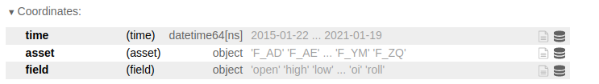
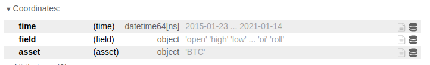
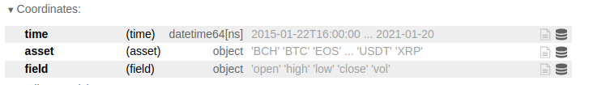

# Data loading

<p class="tip">
This section contains the detailed API reference documentation. It is intended for users who are already familiar with the Quantiacs platform. Fisrt-time users can start at the <a href="/documentation/en/quick_start/quick_start.html">Quick start</a> page.
</p>

## Inspecting the list of Futures

The available futures financial instruments can be inspected using the following function:

**Function**

```python
import qnt.data
qnt.data.futures.load_list()
```

**Output**

The output is a list of dictionaries with info on ticker symbols and assets:

```python
[{'id': 'F_AD', 'name': 'Australian Dollar'},
 {'id': 'F_AE', 'name': 'Aex Index'},
 {'id': 'F_AH', 'name': 'Bberg Commodity Index'},
 {'id': 'F_AX', 'name': 'DAX Index'},
 {'id': 'F_BC', 'name': 'Crude Oil Brent'},
 {'id': 'F_BG', 'name': 'ICE Gas Oil LS'},
 {'id': 'F_BO', 'name': 'Soybean Oil'},
 {'id': 'F_BP', 'name': 'British Pound'},
 {'id': 'F_C', 'name': 'Corn'},
 {'id': 'F_CA', 'name': 'CAC 40'},
 {'id': 'F_CC', 'name': 'Cocoa'},
 {'id': 'F_CD', 'name': 'Canadian Dollar'},
 {'id': 'F_CF', 'name': 'Eurex Conf Long-Term'},
 {'id': 'F_CL', 'name': 'Crude Oil WTI'},
 {'id': 'F_CT', 'name': 'Cotton #2'},
 {'id': 'F_DM', 'name': 'Mdax Index'},
 {'id': 'F_DT', 'name': 'Euro Bund'},
 {'id': 'F_DX', 'name': 'U.S. Dollar Index'},
 {'id': 'F_EB', 'name': 'Eurex 3Month EuriBor'},
 {'id': 'F_EC', 'name': 'Euro FX'},
 {'id': 'F_ED', 'name': 'Eurodollar'},
 {'id': 'F_ES', 'name': 'S&P 500 E-Mini'},
 {'id': 'F_F', 'name': '3-Month Euroswiss'},
 {'id': 'F_FB', 'name': 'Stoxx Banks 600'},
 {'id': 'F_FC', 'name': 'Feeder Cattle'},
 {'id': 'F_FP', 'name': 'OMX Helsinki 25'},
 {'id': 'F_FV', 'name': '5-Year T-Note'},
 {'id': 'F_FY', 'name': 'Stoxx Europe 600'},
 {'id': 'F_GC', 'name': 'Gold'},
 {'id': 'F_GS', 'name': '10-Year Long Gilt'},
 {'id': 'F_GX', 'name': 'Euro Buxl'},
 {'id': 'F_HG', 'name': 'High Grade Copper'},
 {'id': 'F_HO', 'name': 'ICE Heating Oil'},
 {'id': 'F_JY', 'name': 'Japanese Yen'},
 {'id': 'F_KC', 'name': 'Coffee'},
 {'id': 'F_LB', 'name': 'Lumber'},
 {'id': 'F_LC', 'name': 'Live Cattle'},
 {'id': 'F_LN', 'name': 'Lean Hogs'},
 {'id': 'F_LR', 'name': 'Brazilian Real'},
 {'id': 'F_LX', 'name': 'FTSE 100'},
 {'id': 'F_MD', 'name': 'S&P Midcap E-Mini'},
 {'id': 'F_MP', 'name': 'Mexican Peso'},
 {'id': 'F_ND', 'name': 'New Zealand Dollar'},
 {'id': 'F_NG', 'name': 'Natural Gas'},
 {'id': 'F_NQ', 'name': 'Nasdaq 100 E-Mini'},
 {'id': 'F_NR', 'name': 'Rough Rice'},
 {'id': 'F_NY', 'name': 'Nikkei 225'},
 {'id': 'F_O', 'name': 'Oats'},
 {'id': 'F_OJ', 'name': 'Orange Juice'},
 {'id': 'F_PA', 'name': 'Palladium'},
 {'id': 'F_PL', 'name': 'Platinum'},
 {'id': 'F_RB', 'name': 'Gasoline RBOB'},
 {'id': 'F_RF', 'name': 'Euro/Swiss'},
 {'id': 'F_RP', 'name': 'Euro/Pound'},
 {'id': 'F_RR', 'name': 'Russian Ruble'},
 {'id': 'F_RU', 'name': 'Russell 2000 E-Mini'},
 {'id': 'F_RY', 'name': 'Euro/Yen'},
 {'id': 'F_S', 'name': 'Soybean'},
 {'id': 'F_SB', 'name': 'Sugar #11'},
 {'id': 'F_SF', 'name': 'Swiss Franc'},
 {'id': 'F_SI', 'name': 'Silver'},
 {'id': 'F_SM', 'name': 'Soybean Meal'},
 {'id': 'F_SS', 'name': '3-Month Sterling'},
 {'id': 'F_SX', 'name': 'Swiss Market Index'},
 {'id': 'F_TR', 'name': 'South African Rand'},
 {'id': 'F_TU', 'name': '2-Year T-Note'},
 {'id': 'F_TY', 'name': '10-Year T-Note'},
 {'id': 'F_UB', 'name': 'Euro Bobl'},
 {'id': 'F_US', 'name': 'T-Bond'},
 {'id': 'F_UZ', 'name': 'Euro Schatz'},
 {'id': 'F_VX', 'name': 'S&P 500 VIX'},
 {'id': 'F_W', 'name': 'Wheat'},
 {'id': 'F_XX', 'name': 'Stoxx 50'},
 {'id': 'F_YM', 'name': 'Dow Futures Mini'},
 {'id': 'F_ZQ', 'name': '30-Day Fed Funds'}]
```


## Loading Futures Data

Futures data can be loaded using:

**Function**

```python
import qnt.data
qnt.data.futures.load_data(assets = None, min_date = None, max_date = None, dims = ("field", "time", "asset"),
    forward_order = True, tail = 365 * 6)
```

**Parameters**

|Parameter|Explanation|
|---|---|
|assets|list of ticker names to load, example: ["F_AD", "F_BO"]. Default None value loads all assets.|
|min_date|first date in data, example "2006-01-01". Default None value uses max_date-tail.|
|max_date|last date of data. Default None value is current day.|
|dims|tuple with "field", "time", "asset" attributes in the specified order.|
|forward_order|boolean, default True value orders date in ascending order.|
|tail| calendar days, min_date = max_date - tail. Default value is 6 years, 365 * 6.|

**Output**

The output is an xarray.DataArray with historical data for the selected assets. Coordinates are:




**Example**

One can load market data for the Australian Dollar/US Dollar rate and Soybean Oil for the past 15 years as follows:

```python
import qnt.data
data = qnt.data.futures.load_data(assets= ["F_AD", "F_BO"], tail=365*15)
```
Specific fields can be extracted using:

```python
open  = data.sel(field="open")
close = data.sel(field="close")
high  = data.sel(field="high")
low   = data.sel(field="low")

volume_day    = data.sel(field="vol")
open_interest = data.sel(field="oi")

contracts_roll_over = data.sel(field="roll")
```


where:

| Data field | Description |
| ------------------ | -------- |
| open               | Opening daily price.|
| close              | Closing daily price. |
| high               | Highest daily price.|
| low                | Lowest daily price. |
| vol                | Daily trading volume (number of contracts).|
| oi                 | Total number of outstanding contracts.|
| roll              | Futures contract rollover information.|

Data can be nicely displayed using:

```python
open.to_pandas().head()
```

|asset<br/>time|F_AD<br/> |F_BO<br/> |
|---|---|---|
|2016-01-24|0.7527|21.55|
|2016-01-25|0.7501|21.50|
|2016-01-26|0.7523|21.52|
|2016-01-27|0.7502|21.57|
|2016-01-30|0.7485|22.11|

## Loading Bitcoin Futures Data

Bitcoin Futures data can be loaded using:

**Function**

```python
import qnt.data
qnt.data.cryptofutures.load_data(assets = None, min_date = None, max_date = None, dims = ("field", "time", "asset"),
    forward_order = True, tail = 365 * 6)
```

**Parameters**

|Parameter|Explanation|
|---|---|
|assets| Default None value loads the Bitcoin Futures.|
|min_date|first date in data, example "2016-01-01". Default None value uses max_date-tail.|
|max_date|last date of data. Default None value is current day.|
|dims|tuple with "field", "time", "asset" attributes in the specified order.|
|forward_order|boolean, default True value orders date in ascending order.|
|tail| calendar days, min_date = max_date - tail. Default value is 6 years, 365 * 6.|

**Output**

The output is an xarray.DataArray with historical data for the selected assets. Coordinates are:




**Example**

One can load market data for the BTC Futures for the past 7 years as follows:

```python
import qnt.data
data = qnt.data.cryptofutures.load_data(tail=365*7)
```
Specific fields can be extracted using:

```python
open  = data.sel(field="open")
close = data.sel(field="close")
high  = data.sel(field="high")
low   = data.sel(field="low")

volume_day    = data.sel(field="vol")
open_interest = data.sel(field="oi")

contracts_roll_over = data.sel(field="roll")
```

where:

| Data field | Description |
| ------------------ | -------- |
| open               | Opening daily price.|
| close              | Closing daily price. |
| high               | Highest daily price.|
| low                | Lowest daily price. |
| vol                | Daily trading volume (number of contracts).|
| oi                 | Total number of outstanding contracts.|
| roll              | Futures contract rollover information.|

Data can be nicely displayed using:

```python
open.to_pandas().head()
```

|asset<br/>time|BTC<br/> |
|---|---|
|2014-01-23|850.0|
|2014-01-24|847.0|
|2014-01-27|852.0|
|2014-01-28|800.0|
|2014-01-29|826.0|


Because of the short history of the Bitcoin Futures, we have patched its history with the spot Bitcoin one to go back in history.

## Loading Cryptocurrency Data

Cryptocurrency data for:
* Bitcoin (BTC);
* Bitcoin Cash (BCH);
* EOS;
* Ethereum (ETH);
* Litecoin (LTC);
* Ripple (XRP);
* Tether (USDT);

can be loaded using:

**Function**

```python
import qnt.data
qnt.data.crypto.load_data(assets = None, min_date = None, max_date = None, dims = ("field", "time", "asset"),
    forward_order = True, tail = 365 * 6)
```

**Parameters**

|Parameter|Explanation|
|---|---|
|assets| list of assets, example ["ETH"]. Default None value loads all assets.|
|min_date|first date in data, example "2016-01-01". Default None value uses max_date-tail.|
|max_date|last date of data. Default None value is current day.|
|dims|tuple with "field", "time", "asset" attributes in the specified order.|
|forward_order|boolean, default True value orders date in ascending order.|
|tail| calendar days, min_date = max_date - tail. Default value is 6 years, 365 * 6.|

**Output**

The output is an xarray.DataArray with hourly historical data for the selected assets. Coordinates are:




**Example**

One can load market data for Ethereum for the past 5 years as follows:

```python
import qnt.data
data = qnt.data.crypto.load_data(assets= ["ETH"], tail=365*5)
```
Specific fields can be extracted using:

```python
open  = data.sel(field="open")
close = data.sel(field="close")
high  = data.sel(field="high")
low   = data.sel(field="low")

volume    = data.sel(field="vol")
```

where:

| Data field | Description |
| ------------------ | -------- |
| open               | First price in a given hour.|
| close              | Last price in a given hour. |
| high               | Highest price in a given hour.|
| low                | Lowest price in a given hour. |
| vol                | Hourly trading volume.|

Data can be nicely displayed using:

```python
open.to_pandas().head()
```

|asset<br/>time|ETH<br/> |
|---|---|
|2016-03-09 16:00:00|10.297|
|2016-03-09 17:00:00|11.197|
|2016-03-09 18:00:00|11.097|
|2016-03-09 20:00:00|11.195|
|2016-03-09 21:00:00|10.870|
