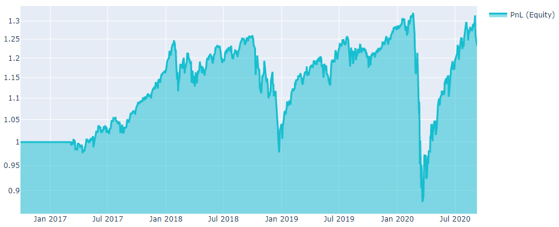
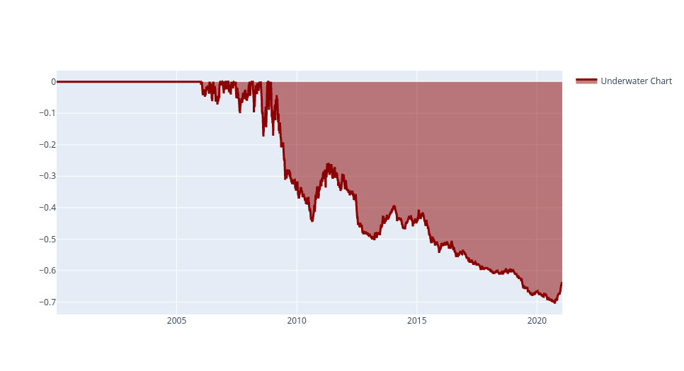
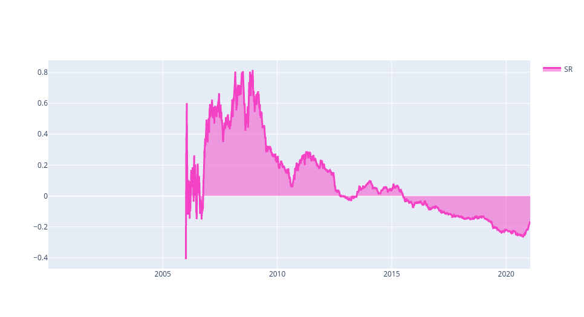

# Evaluation

## Backtesting

The necessary input for backtesting is a set of allocation **weights** (fractions of capital to be invested) for all assets over the backtesting period. Let us suppose that we wrote the code:

```python
import qnt.data as qndata
import qnt.ta as qnta

futures = qndata.futures.load_data(min_date="2006-01-01")

price_open = futures.sel(field="open")
price_open_one_day_ago = qnta.shift(price_open, periods=1)

strategy = price_open - price_open_one_day_ago

weights = strategy / abs(strategy).sum("asset")
```

Then we can submit code by importing in addition the **qnt.output** library:

```python
import qnt.output as output
```

and a call to the **write** function:

```python
output.write(weights)
```

**Function**
```python
qnt.output.write(weights)
```

**Parameters**

|Parameter|Explanation|
|---|---|
|weights|xarray.DataArray with allocation weights for all assets in the backtesting period.|


**Output**

None, the call is mandatory as it will write weights to file used for evaluating performance.

## Statistics
First, to estimate the profitability of the algorithm, we measure the Sharpe ratio (SR), the most important and popular metric. For our platform, we use the annualized SR and assume that there are ≈252 trading days on average per year. The annualized SR must be at least greater than 1 for the In-Sample test. The "calc_stat" function allows to calculate the complete statistics of an algorithm.

**Function**
```python
qnt.stats.calc_stat(data, portfolio_history, slippage_factor=0.05, roll_slippage_factor=0.02,
              min_periods=1, max_periods=None,
              per_asset=False, points_per_year=None)
```

**Parameters**

|Parameter|Explanation|
|---|---|
|data|xarray DataArray with market data of the companies your algorithm invests in |
|portfolio_history|xarray DataArray filled with portfolio weights, corresponding to the investing algorithm |
|slippage_factor|transactions are punished with slippage equal to a given fraction of ATR14|
|roll_slippage_factor| slippage for rolls of futures contracts|
|min_periods|minimal number of days|
|max_periods|max number of days|
|per_asset|calculate stats per asset|
|points_per_year|how many points per year to take as the basis for calculating mean the return

**Output**

The output is xarray with all statistics.

|Output columns|Explanation|
|---|---|
|equity|Profit strategy|
|relative_return| Relative equity change|
|volatility|Annualized Standard deviation of relative return|
|underwater|The decrease in profit from the highest peak|
|max_drawdown|Minimum of underwater|
|mean_return|Annualized mean return|
|sharpe_ratio|Annualized mean return / Annualized volatility|
|bias|sum(position) / sum( abs(position) ) per day|
|instruments|Number of traded financial instruments|
|avg_turnover|Average monthly turnover of positions in the portfolio (one year)|
|avg_holding_time|Average position holding time for one year|

**Example**

Let us assume that you are writing a **buy and hold** strategy:

```python
import qnt.data as qndata
import datetime as dt
import qnt.stats as qnstats        # key statistics
import qnt.graph as qngraph        # graphical tools
from IPython.display import display

# load historical data
data = qndata.load_data(
                       tail = dt.timedelta(days=4*365),
                       dims = ("time", "field", "asset"),
                       forward_order=True)
                       
is_liquid = data.loc[:,"is_liquid",:].to_pandas()

# set and normalize weights:
weights = is_liquid.div(is_liquid.abs().sum(axis=1, skipna=True), axis=0)
weights = weights.fillna(0.0)

#convert to xarray before statistics calculation
output = weights.unstack().to_xarray()
```

After the weights have been computed, one can calculate the statistics in order to evaluate the algorithm on historical data:

```python
stat = qnstats.calc_stat(data, output, slippage_factor=0.05)
display(stat.to_pandas().tail())
```

|field <br/> time|  equity| relative_return|    volatility| underwater| max_drawdown|   sharpe_ratio|   mean_return|    bias|   instruments|    avg_turnover|   avg_holding_time|
|---|---|---|---|---|---|---|---|---|---|---|---|
|2020-09-01 |1.547375   |0.007302|  0.213420|   0.000000|   -0.382386|  0.549581|   0.117291|   1.0|    967.0|  0.026296|   83.810199|
|2020-09-02 |1.565288   |0.011577   |0.213385   |0.000000   |-0.382386  |0.564401   |0.120434   |1.0    |967.0  |0.026506   |85.397114|
|2020-09-03|    1.514099|   -0.032703|  0.213932|   -0.032703|  -0.382386|  0.518395|   0.110901|   1.0|    967.0|  0.026526|   85.397114|
|2020-09-04|    1.501310|   -0.008446|  0.213872|   -0.040873|  -0.382386|  0.506844|   0.108400|   1.0|    967.0|  0.026522|   85.397114|
|2020-09-08|    1.472630|   -0.019104|  0.213991|   -0.059196|  -0.382386|  0.480810|   0.102889|   1.0|    967.0|  0.026517|   165.190915|


```python
# show plot with profit and losses:
performance = stat.to_pandas()["equity"]
qngraph.make_plot_filled(performance.index, performance, name="PnL (Equity)", type="log")
```



```python
# show underwater chart:
UWchart = stat.to_pandas()["underwater"]
qngraph.make_plot_filled(UWchart.index, UWchart, color="darkred", name="Underwater Chart", range_max=0)
```



```python
# show rolling Sharpe ratio on a 3-year basis:
SRchart = stat.to_pandas()["sharpe_ratio"].iloc[(252*3):]
qngraph.make_plot_filled(SRchart.index, SRchart, color="#F442C5", name="Rolling SR")
```



