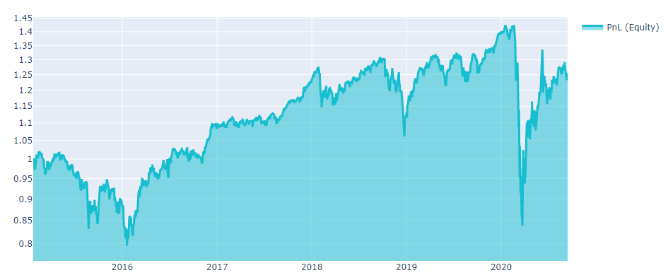
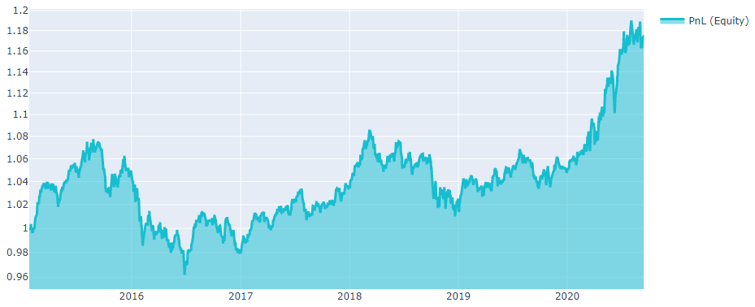

# Improve the strategy

## Exposure improving

If the algorithm does not pass the [exposure filter](https://quantiacs.io/documentation/en/improve/max-sw.html), one may use one of the two options bellow:

### Remove days with high exposures

**Function**
```python
rm_days_with_high_exposure(weights):
    exposure = qnstats.calc_exposure(weights)
    return weights.where(exposure.max('asset') < 0.049, 0)
```

**Parameters**
|Parameter|Explanation|
|---|---|
|weights|xarray DataArray with weights of the algorithm.|

**Output**

The output is xarray DataArray with final improved weights, passing the maximum stock weight filter.

**Example**

```python
out3 = rm_days_with_high_exposure(output2)
qnstats.check_exposure(out3)
```


### Mix weights

**Function**
```python
mix_weights(primary, secondary, max_weight = 0.049)
```

**Parameters**

|Parameter|Explanation|
|---|---|
|primary|xarray DataArray with weights of the algorithm that is need to be improved.|
|secondary|xarray DataArray with weights of the algorithm that passes the maximum stock weight filter.|
|max_weight|the maximum stock weight. Default value  = 0.049|

**Output**

The output is xarray DataArray with final improved weights, passing the maximum stock weight filter.

**Example**

```python
mean_weights = data.sel(field='is_liquid')
mean_weights = mean_weights/abs(mean_weights).sum('asset')

out4 = mix_weights(output2, mean_weights, max_weight = 0.049)

qnstats.check_exposure(out4)
```

## Neutralization

We can exclude the market influence by balancing long/short positions for our algorithm. Thus, the total investment in the market will be $0. The neutralization could be done for the whole market or each industry (or smaller group). Mathematically, market neutralization is elementary - one needs to substruct the mean value for each day. The more details are [here](https://quantiacs.io/documentation/en/improve/neutralization.html).

**Function**
```python
qnt.neutralization.neutralize(weights, assets, group = 'market')
```

**Parameters**

|Parameter|Explanation|
|---|---|
|weights|xarray DataArray with weights of the algorithm.|
|assets|qnt.data.load_assets. It is the list of dicts with info for desired tickers.|
|group|str, default='market'. Neutralize positions by 'market', 'industry' or 'sector'.|

**Output**

The output is xarray DataArray with neutralized positions among the selected group.

**Example**

We can consider the implementation of the neutralization function on an example of an investing strategy. Each algorithm starts with loading libraries and data:

```python
# Basic libraries.
import xarray as xr
import numpy as np
import pandas as pd
import matplotlib.pyplot as plt

# Import quantiacs libraries.
import qnt.data    as qndata
import qnt.stats   as qnstats
import datetime    as dt
import qnt.graph   as qngraph
from qnt.neutralization import neutralize
import qnt.data.secgov_indicators
```


```python
# Load all available asset names since the given date.
assets = qndata.load_assets(min_date = '2015-01-01')
assets_names = [i["id"] for i in assets]


data = qndata.load_data(min_date = '2015-01-01',
                        dims=("time", "field", "asset"),
                        assets=assets_names,
                        forward_order=True)

# We trade only liquid stocks
is_liquid = data.loc[:,"is_liquid",:]

# replace zeros in liquid with NaN
index = np.array(abs(is_liquid - 1),dtype = bool)
is_liquid.to_pandas()[index] = np.nan
```

```python
# desired fundamental data
data_lbls = ['ppent']

# One can load corresponding data
fun_data1 = qnt.data.secgov_load_indicators(assets,time_coord = data.time, standard_indicators = data_lbls)
```

```python
# In order to estimate Sharpe for a number of algorithms
def estimate_sharpe(weights_final):
    stat = qnstats.calc_stat(data, weights_final, slippage_factor=0.05)
    days = len(stat.coords["time"])
    returns = stat.loc[:, "relative_return"]

    sharpe_ratio = qnstats.calc_sharpe_ratio_annualized(
        returns,
        max_periods=days,
        min_periods=days).to_pandas().values[-1]

    print(f'Sharpe ratio = {sharpe_ratio}')
```


Let's say you have an idea - make an algorithm based on property, plant, and equipment (PP&E) amount.

```python
weights = fun_data1.sel(field = 'ppent')*is_liquid
weights = weights/abs(weights).sum('asset')
estimate_sharpe(weights)
```

```python
Sharpe ratio = 0.2009557067119658
```

Investments in property may move up or down in a short term according to market situations and economic conditions. Thus, the economic situation in the world will affect the PnL chart (including global economic crises).

```python
stat = qnstats.calc_stat(data, weights, slippage_factor=0.05)

# show plot with profit and losses:
performance = stat.to_pandas()["equity"].iloc[:]
qngraph.make_plot_filled(performance.index, performance, name="PnL (Equity)", type="log")
```



One can remove market influence by applying neutralization function:

```python
output = neutralize(-weights,assets,group = 'market')
estimate_sharpe(output)
```

```python
Sharpe ratio = 0.562002051169064
```

The chart below shows that global crises do not affect PnL behavior for the improved algorithm.

```python
stat = qnstats.calc_stat(data, output, slippage_factor=0.05)

# show plot with profit and losses:
performance = stat.to_pandas()["equity"].iloc[:]
qngraph.make_plot_filled(performance.index, performance, name="PnL (Equity)", type="log")
```




