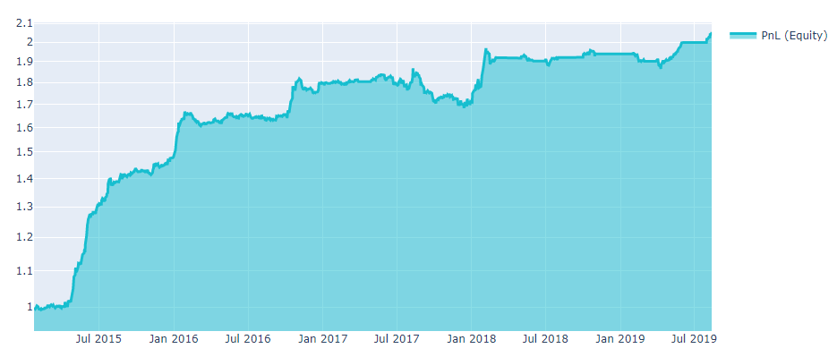
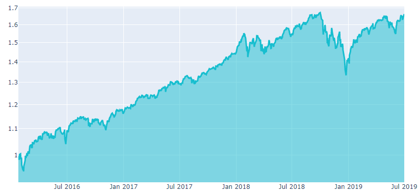
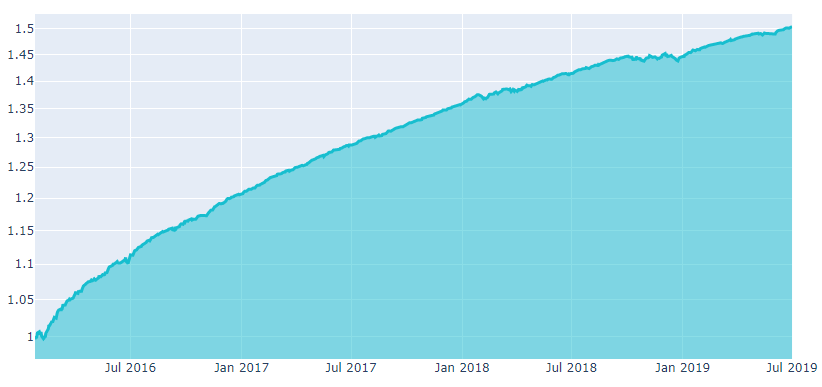
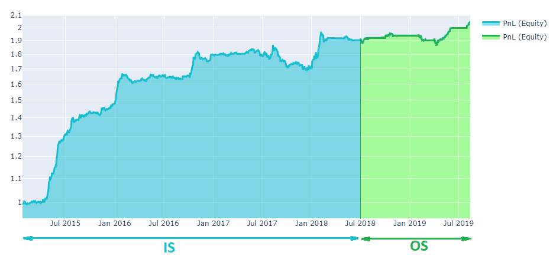
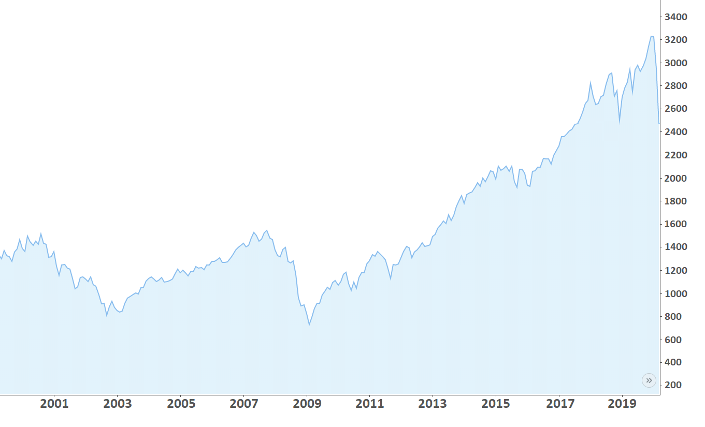

# What is Algorithmic Trading?

"Algorithmic trading is a process for executing orders utilizing automated and pre-programmed trading instructions to account for variables such as price, timing and volume. An algorithm is a set of directions for solving a problem. Computer algorithms send small portions of the full order to the market over time." - Investopedia.

## Вasic concepts

The decision to buy or sell financial securities uses a predetermined algorithm, with the intent to make a profit. On our platform, this algo is a python script which takes historical data as an input and gives a decision to buy/sell  as output.

Let us say that we have a capital of 1M USD and we want to invest in a portfolio consisting of three stocks: Apple Inc (AAPL), Alphabet Inc Class C (GOOG), Tesla Inc (TSLA). Let us have a look at the open price of these stocks for some period. The open price is the price at which a security first trades upon the opening of an exchange on a trading day. We use historical data from the NASDAQ exchange as input:

| date         | AAPL   | GOOG     | TSLA   |
|:------------:| ------:| --------:| ------:|
| Mar 02, 2020 | 282.28 | 1,351.61 | 711.26 |
| Mar 03, 2020 | 303.67 | 1,399.42 | 805.00 |
| Mar 04, 2020 | 296.44 | 1,359.23 | 763.96 |

_Table 1: Stock open price in USD. NASDAQ exchange._

Now we need to define an algorithm which allocates our capital to stocks. The algorithm can be seen as an intelligent search of some world event reflected in data. Suppose that we have a simple hypothesis: invest more if open price is low. This hypothesis can be expressed through the formula:


```math
\label{alpha1}
    \frac{1}{\textbf{open}}.
```

Hereinafter we will use bold symbols for vectors. We can receive a matrix form of the algorithm by applying formula (2) to the table 1:

| date         | AAPL          | GOOG          | TSLA          |
|:------------:| -------------:| -------------:| -------------:|
| Mar 02, 2020 | 0.00354258183 | 0.00073985839 | 0.00140595562 |
| Mar 03, 2020 | 0.00329304837 | 0.00071458175 | 0.00124223602 |
| Mar 04, 2020 | 0.00337336391 | 0.00073571065 | 0.00130896905 |

_Table 2: Matrix form of the algorithm._

The capital is distributed in proportion to the values of the matrix. To receive the shares of capital invested in each stock, the matrix (table 2) must be normalized  (``$` l_1 `$`` norm) to one for each day:

| date         | AAPL   | GOOG   | TSLA   |
|:------------:| ------:| ------:| ------:|
| Mar 02, 2020 | 0.6228 | 0.1301 | 0.2472 |
| Mar 03, 2020 | 0.6273 | 0.1361 | 0.2366 |
| Mar 04, 2020 | 0.6226 | 0.1358 | 0.2416 |

_Table 3: Final weights of the algorithm._

Thus, $1M·0.6228 = 622,800$ USD were allocated for AAPL on Mar 02, 2020; GOOG and TSLA received $130,100$ USD and $247,200$ USD. The matrix values (3) are called weights of the algorithm.

## Long Position vs. Short Position

To sell a stock, one needs simply to assign it a negative weight in the algorithm. Let us assume that you have the following weights:

|date          | AAPL | GOOG | TSLA |
| ------------ | ---- | ---- | ---- |
| Mar 02, 2020 | 0.4  |  0.4 | -0.2 |


The positive sign means that we hold a long position (buy shares); the
negative sign means that we hold a short position (sell shares). Thus, the
1M USD capital will be allocated in the following proportions:
$400,000$ USD to AAPL; $400,000$ USD to GOOG; $-200,000$ to TSLA.

**Details**

For our platform, we use a simplified treatment of short positions and
mirror long positions. For a real-environment trading one needs to
remember that short positions are associated with higher risks. An
investor selling shares that he does not yet own (as a rule, from his
broker's account) is obligated to buy them back after a while. Thus, the
investor expects a fall in prices and plays against the market. It leads
to several risks:

-   Some stocks are hard to borrow. The reason is high demand, a limited
    number of securities and so on. For a short position for such
    securities, the broker charges an additional fee.

-   The short seller is responsible for paying dividends on shares to
    the person from whom they were borrowed.

-   The potential losses in a short sale can be endless, because
    theoretically the maximum price of a stock is unlimited. On the other
    hand, the stock price will not fall below zero, so the maximum
    profit is limited.

-   Even if the estimate is correct, the moment may be inappropriate. It
    is extremely unprofitable to hold a short position at a rising price
    for a long time.

## Relative returns

The investment portfolio is redistributed according to the algorithm
once a day (the exchange has 252 working days a year). Redistribution
occurs at the beginning of the day. For our platform, we assume that the
purchase of shares occurs at the *open* price.

Equity grows with the correct prediction of price changes. The daily
change in equity is estimated after the end of the trading day and
strongly depends on the *close* price. *Close* is the price at which a
security last trades on a trading day.

Algorithm results, calculated on historical data, are usually presented
on an equity graph in order to understand the behaviour of the
cumulative profit. In our platform, we set initial equity to 1, so it
can be scaled easily.





Relative returns simply indicate how much the capital has changed. For
the ``$`i^{th}`$`` day we introduce the relative returns (rr) in unit
fractions:

```math
\label{equity1}
    \text{rr}[i] = \frac{\text{equity}[i]}{\text{equity}[i-1]} - 1,
```

**Details**

Sometimes it's important to understand how equity (cumulative profit,
PnL) is calculated. Say we allocate our capital in a proportion to the
vector of **weights** for the ``$`i^{th}`$`` day. Thus we buy shares at **open**
price and receive the following positions:

```math
\label{position}
    \textbf{pos}[i] = \left( \textbf{weights}[i]\cdot\text{equity}[i] \right)/\textbf{open}[i],
```

where bold variables stand for vectors in the space of shares; division
is elementwise. For the next day, an algorithm will generate a new
vector of **weigths** that will redistribute our capital
into new positions. Redistribution of portfolio instruments leads to
capital losses associated mainly with the broker's commission and the
*slippage*.

It is quite clear that the greater part of the capital we must
redistribute, the more broker's commission affects our profit. For real
trading, slippage has a more significant impact on profit than the
commission, so in our platform, we only consider slippage.

What is the slippage? We need a buyer/seller to sell/buy any shares. If
there is no offer on the exchange, the order is opened at a new price.
Thus, we buy the desired number of shares in parts, using offers to
buy/sell a specific number of shares at a specific price. We calculate
*slippage* according to the following formula:

```math
\label{slippage}
    \text{slippage}[i] = abs(\textbf{pos}[i] - \textbf{pos}[i-1])\cdot \textbf{ATR}(14) \cdot 0.05,
```
where ``$` \textbf{ATR}(14) `$`` - is a market volatility indicator. The Average True Range (``$` \textbf{ATR}(N) `$``) indicator is a moving average (MA) over N
days of the true range (**TR**) values:

```math
\begin{gathered}
\label{ATR}
    \textbf{TR}[i] = max(
\textbf{high}[i] - \textbf{low}[i]; |\textbf{high}[i] - \textbf{close}[i-1]|; |\textbf{close}[i-1] - \textbf{low}[i]|), \end{gathered}
```

```math
\label{ATR2}
    \textbf{ATR}(N) = MA(\textbf{TR},N).
```

Now we can introduce the equity formula for the i day:

```math
\begin{gathered}
    \text{equity}[i] = \text{equity}[i - 1] + (\textbf{open}[i] - \textbf{close}[i-1]) \cdot \\ \textbf{pos}[i-1] + (\textbf{close}[i] - \textbf{open}[i]) \cdot \textbf{pos}[i] - \text{slippage}[i]
    \label{equity}\end{gathered}
```

## Algorithm quality

Once we have constructed an algorithm and plotted an equity on a historical data, we need to use a set of criteria to evaluate the performance.

### Sharpe Ratio

First, to estimate the profitability of the algorithm, we measure the Sharpe ratio (SR), the most important and popular metric. For our platform, we use the annualized SR and assume that there is ≈252 trading days on average per year. The annual SR formula for N days is presented below:

```math
\label{SR_final_first}
    \text{SR} = \frac{\sqrt[N]{[\prod\limits_{i=1}^{N} (rr_i + 1)]^{252}} - 1}{\sqrt{\frac{252}{N}\sum\limits_{i=1}^{N} (rr_{i}  - \overline{rr}) }},
```

where ``$` rr_i `$`` stands for the daily relative returns (of the i'th day),
``$`\overline{rr}`$`` denotes the expected value.

The numerator is an average daily return. The book size changes with the size of equity, thus the numerator is a geometric mean.

The denominator is a standard deviation of the portfolio’s excess return. Another way to think about the denominator is that it means volatility.

Thus, the Sharpe ratio is the return per unit of risk (volatility). The greater the Sharpe ratio, the better (second figure). To submit a strategy successfully, the SR should be higher than 0.7 in the in-sample period.




**Details**

In 1994, William Sharpe defined the Sharpe ratio as:

```math
\label{SR_1}
    \text{SR} = \frac{E(R_p - R_f)}{\sigma_p},
```
    
where ``$` R_p `$`` - return of the portfolio
, ``$` R_f `$`` - risk-free rate, ``$` E(R_p - R_f) `$`` - s the expected value of the excess of the portfolio return over the benchmark return,
``$` \sigma_p `$`` - standard deviation of the portfolio's excess return. We
assume risk-free rate to be zero (alternative way to compute the Sharpe ratio is to set S&P 500 total return as a risk-free rate). For N trading days:
 
```math
 \label{SR_2}
    \text{SR} = \frac{\text{average daily return}}{\text{daily volatility}} = \frac{\sqrt[N]{\prod\limits_{i=1}^{N} (rr_i + 1)} - 1}{\sqrt{\frac{1}{N}\sum\limits_{i=1}^{N} (rr_{i}  - \overline{rr}) }},
```

where ``$` \overline{rr} `$`` - denotes the expected value of relative returns. The book size changes with the size of equity, thus the numerator is a geometric mean. Now we introduce the SR, scaled on an arbitrary period ``$` T `$``:

```math
\label{SR_final}
    \text{SR} = \frac{\sqrt[N]{[\prod\limits_{i=1}^{N} (rr_i + 1)]^T} - 1}{\sqrt{\frac{T}{N}\sum\limits_{i=1}^{N} (rr_{i}  - \overline{rr}) }}.
```

For annual Sharpe ratio one can put T= 252 - trading days per year. We use the annual (T= 252) Sharpe ratio to estimate algorithms on our platform.

### Uniqueness

 A good algorithm must minimize the overlap with well-known and already existing signals. Uniqueness can be defined in terms of the maximum correlation of the algorithm to the pool of the existing algorithms: 

```math
r_{XY} = \frac{\text{cov}_{\textbf{X}\textbf{Y}}}{\sigma_{\textbf{X}} \sigma_{\textbf{Y}}}
```

## In Sample and Out of Sample

  Overfitting is easy. If one tries a significant amount of algorithm
  configurations, backtest can be fitted to any desired performance. Overfitting 
  can be avoided by splitting the data into an In Sample and and an Out of Sample
  slices.

**In sample**

  By \"sample\" we mean a data sample. An *In-Sample* (IS) set is the
  analogue of a training set in machine
  learning.

**Out of sample**

  The *out-of-sample* (OS) set is the analogue of the testing set in machine
  learning. It is good practice to develop your algorithm on IS data and test
  it on OS unseen data.

**Competition**

  The performance of a good algorithm OS does not degrade compared to the IS period.




## Improving the algorithm

### Neutralization

Let us analyse the stock performance of 500 large companies listed on
stock exchanges in the United States, the so-called S&P500 index. As
one can see, the market grows on average. S&P500 return vary widely
from a few percent to over 20% in some
[years](https://www.cnbc.com/2017/06/18/the-sp-500-has-already-met-its-average-return-for-a-full-year.html).
Does it mean that simply opening a long positions is a good idea?




Unfortunately, periodic financial crises occur:

-   1987, the Black Monday. 

-   2000-2003, The Crash of the Dotcoms.

-   2007-2008. the Financial Crisis.

The consequences of crises are visible on the chart and appear as market
drops of up to 30%. It is dangerous to think that crises are horror
stories from the past. 

We can exclude the market influence by balancing long/short positions
for our algorithm. So, it will be a market-neutral algo. The neutralization
could be done for the whole market or each industry (or smaller group).
Mathematically, market neutralization is elementary.

Say, we a have a vector of **weights<sub>i</sub>** for i day, given by
the algorithm. In order to make the algorithm a market-neutral one, it is
enough to apply the following equation for each day:

**neutralized\_weights<sub>i</sub>** = **weights<sub>i</sub>** - mean(**weights<sub>i</sub>**).

Now the mean of weights for each day is zero. It means that we neither
invest money nor withdraw it from the market.
