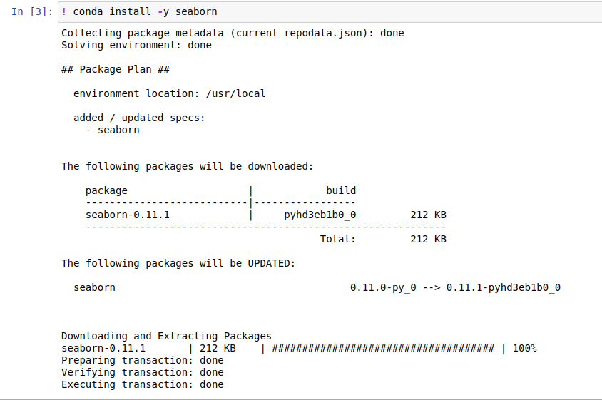

# Your environment

When you work inside the Quantiacs Jupyter environment you will have access to a root directory with several sub-directories and files.

- **data-cache**: This directory stores loaded data for a faster evaluation.

- **qnt**: This directory contains the source code of the Quantiacs backtester, including all functions to deal with data and statistical indicators. You can use it as a reference if you are interested in the details of the evaluation. If you have a question or find a bug, please contact us at info@quantiacs.com. Note that the sub-directory **ta** contains useful technical indicators.

- **examples** : This directory contains the examples which demonstrate major features of the qnt library.

- **init.ipynb**: This file can be used for installing the additional libraries needed by your strategy, like keras or sklearn. The evaluator will run this file once to prepare the environment for your strategy. Let us suppose you want to use seaborn for visualizing data, https://seaborn.pydata.org/. As Jupyter allows you to run shell commands using !, you can for example type:

```
!conda install -y seaborn
```



**conda** is our preferred package manager but you can use also **pip** in the **init** file.

- **precheck.ipynb**: This file allows you to pre-check your strategy.
Strategies need to pass filters for being accepted to our contests: for example, the In-Sample Sharpe ratio should be larger than 1 at submission time.
We advise you to run this notebook before submitting your **strategy** and fix all ERROR and WARNING messages.
Use this notebook if you want to submit single-pass implementation.
If you use multi-pass(qnt.backtest), you this check is not necessary.

- **strategy.ipynb**: This file MUST contain your strategy for submission. We recommend using a separate instance of a jupyter notebook (which you can call for example **research.ipynb**) for development. Once you are ready to submit, you should remove unnecessary components and submit the optimized version coded in the **strategy.ipynb** file.

