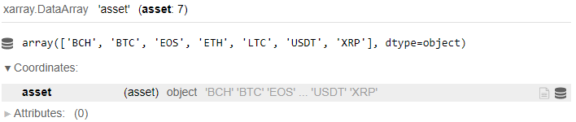
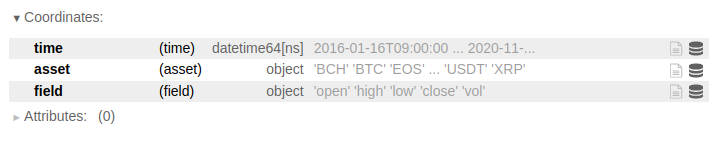
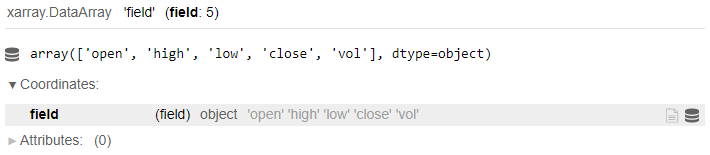
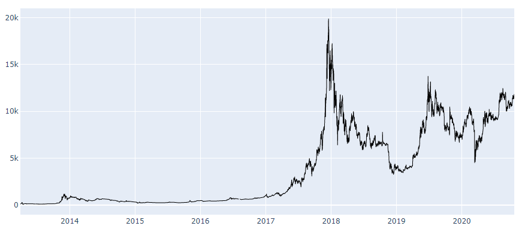

# Cryptocurrencies

Quantiacs provides up-to-date hourly data - price and volume - for the following cryptocurrencies: 

* Bitcoin (BTC); 
* Bitcoin Cash (BCH);
* EOS;
* Ethereum (ETH);
* Litecoin (LTC);
* Ripple (XRP);
* Tether (USDT). 

The available cryptocurrency data for the last 5 years can be loaded using:
```python
import qnt.data as qndata

crypto_data = qndata.crypto.load_data(tail = 365 * 5)
```

The list of available cryptocurrencies can be obtained writing:
```python
crypto_data.asset
```


For each cryptocurrency data are available on an hourly resolution. **crypto_data** is an xarray.DataArray structure whose coordinates are:

* **time**: a date-time in format yyyy-mm-ddTHH-MM-SS;
* **field**: an attribute, for example the opening hourly price;
* **asset**: the identifying symbol for the asset, for example ETH for Ethereum.



It contains **5 parameters**:
```python
crypto_data.field
```


| Data field | Description |
| ------------------ | -------- |
| open               | First price in the selected hour.|
| close              | Last price in the selected hour. |
| high               | Highest hourly price. |
| low                | Lowest hourly price. |
| vol                | Hourly trading volume in the related cryptocurrency value.|

Let us say that we are interested in the highest hourly price for BTC. We can use:

```python
BTC_high = crypto_data.sel(field = 'high').sel(asset = 'BTC')
```

Data can be visualized using:

```python
import plotly.graph_objs as go         # lib for charts

trend_fig = [
    go.Scatter(
        x = BTC_high.to_pandas().index,
        y = BTC_high,
        line = dict(width=1,color='black'))]
# draw chart
fig = go.Figure(data = trend_fig)
fig.update_yaxes(fixedrange=False) # unlock vertical scrolling
fig.show()
```


