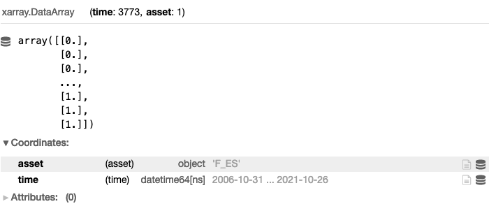
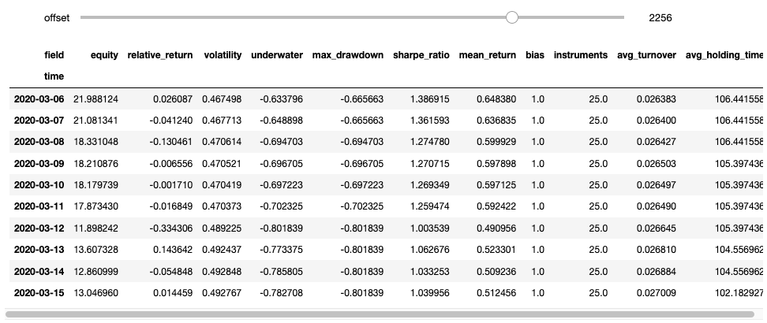
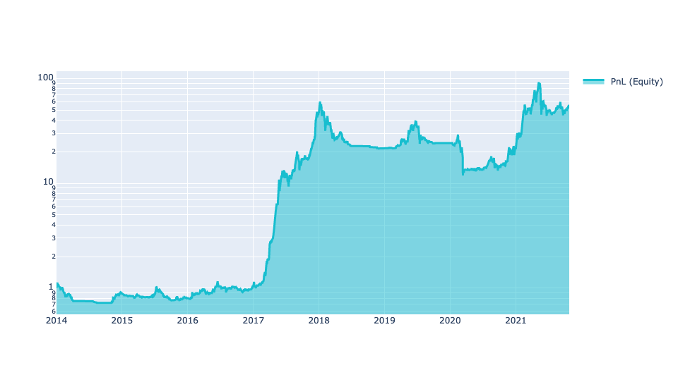
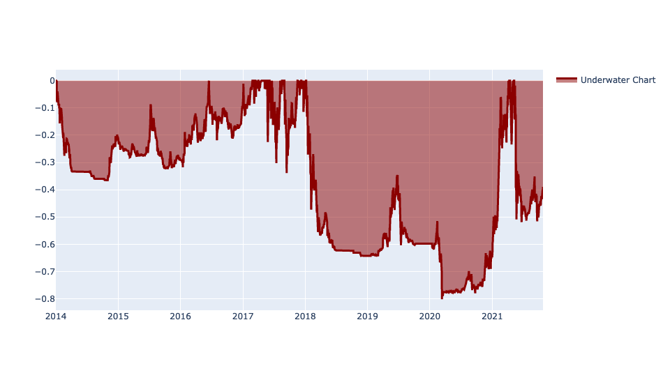

# Algorithm quality

Once we have developed an algorithm we can have an idea of its performance by an  inspection of a few statistical indicators, for example the equity chart.

Basically there are two main ways to evaluate the performance of your algorithm:
- [Single-pass Backtesting](#single-pass-backtesting)
- [Multi-pass Backtesting](#multi-pass-backtesting)
----

## Single-Pass Backtesting

With single-pass backtesting you give a set of allocation weights (fractions of capital to be invested) for all assets over the entire backtesting period.

This approach evaluates your strategy very quickly, **but you need to be careful** because it cannot check if your algorithm uses data of the future when determining allocation weights.

Let us consider a simple long-only strategy on the S&P500 Index Futures: we go long once the Simple Moving Average (**qnta.sma**) of the close price over the last 20 trading days is larger than the Simple Moving Average of the close price over the last 150 trading days.

```python
import xarray as xr

import qnt.ta as qnta
import qnt.data as qndata
import qnt.output as qnout

data = qndata.futures_load_data(tail=365 * 15, assets= ['F_ES'])

close = data.sel(field='close')

sma150 = qnta.sma(close, 150)
sma20  = qnta.sma(close, 20)

weights = xr.where(sma150 < sma20, 1, 0)

weights = weights / abs(weights).sum('asset')

weights = qnout.clean(weights, data, 'futures')
weights
```
The weights xarray would look like this:



We can plot the equity chart on historical data by adding:

```python
import qnt.stats as qnstats
import qnt.graph as qngraph

statistics = qnstats.calc_stat(data, weights)

performance = statistics.to_pandas()['equity']
qngraph.make_plot_filled(performance.index, performance, name='PnL (Equity)')
```


Other key statistical indicators can also be obtained by calling the **calc_stat** function:

* **equity**: the cumulative value of profits and losses since inception;
* **relative_return**: the relative daily variation of **equity**;
* **volatility**: the volatility of the investment since inception (i.e. the annualized standard deviation of the daily returns);
* **underwater**: the time evolution of drawdowns;
* **max_drawdown**: the absolute minimum of the underwater chart;
* **sharpe_ratio**: the annualized Sharpe ratio since inception; the value must be larger than 1 for taking part to contests;
* **mean_return**: the annualized mean return of the investment since inception;
* **bias**: the daily asymmetry between long and short exposure: 1 for a long-only system, -1 for a short-only one;
* **instruments**: the number of instruments which get allocations on a given day;
* **avg_turnover**: the average turnover;
* **avg_holding_time**: the average holding time in days.


All available results (indicators) can be displayed by calling:
```python
statistics = qnstats.calc_stat(data, weights)
display(statistics.to_pandas().tail())
```


Please note that a **submission** needs to have an In-Sample Sharpe ratio **larger than 1!**

For a more detailed description on evaluating your algorithm with single-pass backtesting consult our API-Reference: [Single-Pass Backtesting](https://quantiacs.com/documentation/en/reference/evaluation.html#single-pass-backtesting) and [Statistics](https://quantiacs.com/documentation/en/reference/evaluation.html#statistics)

----

## Multi-Pass Backtesting
For multi-pass backtesting on the other hand, you define a function that provides a set of allocation weights for the next trading day based on the entire data up to that day.

This approach actively **prevents** looking-in-the-future issues.

Let us consider a simple long-only strategy on Cryptocurrencies: we go long once the Simple Moving Average (**qnta.sma**) of the close price over the last 20 trading days is larger than the Simple Moving Average of the close price over the last 200 trading days.


*For this particular trading competition, which is where this example came from, it was important to only trade cryptocurrencies that were in the top 10 in market cap at the given time. Hence the* ***weights * is_liquid*** *step.*

```python
import xarray as xr

import qnt.ta as qnta
import qnt.backtester as qnbt
import qnt.data as qndata


def load_data(period):
    return qndata.cryptodaily_load_data(tail=period)


def strategy(data):
    close = data.sel(field='close')
    is_liquid = data.sel(field='is_liquid') # this field tags cryptocurrencies which, at a given point in time,
                                            # are among the 10 ones with the largest market capitalization
    sma_slow = qnta.sma(close, 200).isel(time=-1)
    sma_fast = qnta.sma(close, 20).isel(time=-1)
    weights  = xr.where(sma_slow < sma_fast, 1, 0) # weights only for one trading day
    weights  = weights * is_liquid  # trade only cryptocurrencies which were among the top 10 in terms
                                   # of market capitalization at each point in time
    weights = weights / 10.0
    return weights


weights = qnbt.backtest(
    competition_type= 'crypto_daily_long',
    load_data= load_data,
    lookback_period= 365,
    start_date= '2014-01-01',
    strategy= strategy
)
```
The backtesting happens when we call **qnbt.backtest()**. After completion it gives us different statistics and graphs, including:
* it automatically checks the sharpe ratio:


Please note that a **submission** needs to have an In-Sample Sharpe ratio **larger than 1!**

* it provides an overview over key statistic each day with an slidable interface:




* it also helps with evaluation of your algorithm by automatically visualizing different charts; for example equity, and underwater chart:




For a more detailed description on evaluating your algorithm with multi-pass backtesting consult our API-Reference: [Multi-Pass Backtesting](https://quantiacs.com/documentation/en/reference/evaluation.html#multi-pass-backtesting) and [Statistics](https://quantiacs.com/documentation/en/reference/evaluation.html#statistics)
