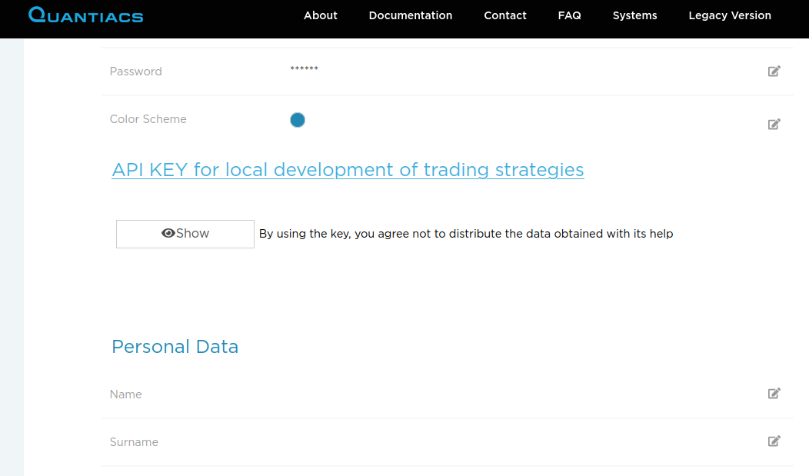
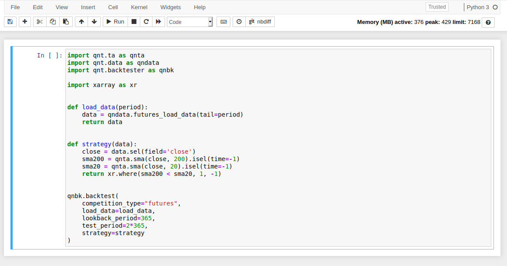

# Local development of trading strategies

## Conda environment
You can use the Quantiacs library (QNT) for developing locally trading strategies on your computer.

The preferred option is to use **conda** because it is the most convenient, stable and tested solution.

You can follow these easy steps and create an isolated environment on your machine using **conda** for managing
dependencies and avoiding conflicts:

1. Install Anaconda from [https://www.anaconda.com/products/individual](https://www.anaconda.com/products/individual)
   or [https://repo.anaconda.com/archive/](https://repo.anaconda.com/archive/).
2. Create an isolated environment for developing strategies and install the QNT library together with needed
   dependencies:
    ```bash
    conda create -n qntdev quantiacs-source::qnt conda-forge::ta-lib conda-forge::dash==1.18 python==3.7
    ```
3. Set your API key. You can find it in your profile on your personal Quantiacs area.

   

    ```bash
    conda env config vars set -n qntdev API_KEY={your_api_key_here}
    ```
    *The command above saves the variable in the conda environment. When you activate it, conda will set up this environment variable. If you have any problem with conda environment variables (known issue with PyCharm), you can set this environment variable in the run settings or write the key directly to the source code. Just add these lines to the head of your strategy before other imports:*
   ```python
    import os
    os.environ['API_KEY'] = "{your_api_key_here}"
    ```

4. Activate your environment if not yet activated:
   ```bash
   conda activate qntdev
   ```
   For leaving the environment:
   ```bash
   conda deactivate
   ```
   Each time you want to use the QNT library, reactivate the environment.


5. Develop your strategy using the IDE you like. For example, you can develop strategies using Jupyter notebook (specify your {USER_NAME}):
     ```bash
      conda install notebook python=3.7 &&
      conda deactivate && 
      conda activate qntdev && 
      /home/{USER_NAME}/anaconda3/envs/qntdev/bin/jupyter notebook
      ```

A good starting point is represented by the following **strategy.py** file, where a simple long-short trading strategy
based on the crossing of two simple moving averages with lookback periods of 20 and 200 trading days is implemented:

   ```python
   import qnt.ta as qnta
   import qnt.data as qndata
   import qnt.backtester as qnbk
   
   import xarray as xr
   
   
   def load_data(period):
       data = qndata.futures_load_data(tail=period)
       return data
   
   
   def strategy(data):
       close = data.sel(field='close')
       sma200 = qnta.sma(close, 200).isel(time=-1)
       sma20 = qnta.sma(close, 20).isel(time=-1)
       return xr.where(sma200 < sma20, 1, -1)
   
   
   qnbk.backtest(
       competition_type="futures",
       load_data=load_data,
       lookback_period=365,
       test_period=2*365,
       strategy=strategy
   )
   ```

Here we have used the function qnt.backtester.backtest whose details can be found in your private area in the
/qnt/backtester.py file.

The function requires the following input:

* competition type: "futures" for the futures contest or "cryptofutures" for the Bitcoin futures contest;
* load data: the pre-defined load_data function. The period passed to load_data is given by test_period +
  lookback_period;
* lookback_period: the maximal lookback period in calendar days used for building indicators. In this case, as we use
  200 trading days for defining the largets simple moving average, 1 year is fine;
* test_period, in calendar days, is the In-Sample period used for the simulation. Here we use 2 years of data;
* strategy: the pre-defined strategy function which should return allocation weights for all assets at a fixed point in
  time (note that in strategy we select the last index, isel(time=-1)).

This strategy uses a lookback period of 365 calendar days for computing indicators and, after a warmup of 365 calendar
days, performs a simulation for 2 years.

6. Use this command to run your strategy (replace **python** with **python3** if your default python version is 2):
   ```bash
    python strategy.py
   ```

7. When you finish with developing your strategy, you need to upload your code in the Jupyter Notebook environment on the
   Quantiacs webpage. There are 2 options:

   a) Copy and paste your code inside the cell of a Jupyter Notebook:

   

   b) Upload your python file (for example, **strategy.py**) in your Jupyter environment root directory and type in 
   **strategy.ipynb**:

        import strategy
        
   > Place the installation commands for external dependencies to `init.ipynb`. 

8. Run all cells to test your strategy in the Jupyter Notebook. Fix the errors if it is necessary. It is a good idea to
   run the file **precheck.ipynb**.

9. Send your strategy to the Contest from the **Development** area on your home page by clicking on the **Submit**
   button:

   


10. Wait for your strategy to pass contest filters and take part in the Contest.

## Pip environment

**We do not recommend this option as for developing Quantiacs we are using conda.**

If you cannot use conda, it is possible to use pip for your environment.

Read [this guide](https://packaging.python.org/guides/installing-using-pip-and-virtual-environments/)
and use a virtual environment to avoid breaking your default environment.

This command installs the Quantiacs library:
```
pip install git+git://github.com/quantiacs/toolbox.git
```

Probably, you will need to install also [TA-Lib library](https://mrjbq7.github.io/ta-lib/install.html) if you need technical indicators.

If you work without jupyter, you will need dash:
```
pip install dash==1.18
```

When you run your strategies, specify the api key in the head of your source file(or notebook) before other imports:
```
import os
os.environ['API_KEY'] = "{your_api_key_here}"
```

You can find this api key in your profile on your personal Quantiacs area.


Then follow the instruction for conda from point 6.

## Google Colab support

If you want to use Google Colab with a hosted runtime, start with this [notebook](../_static/colab.ipynb).

This notebook contains the necessary commands to configure a hosted runtime.

If you use colab with a local runtime, then you can use regular conda environment. Go to the head of this page and follow the instructions for conda.
