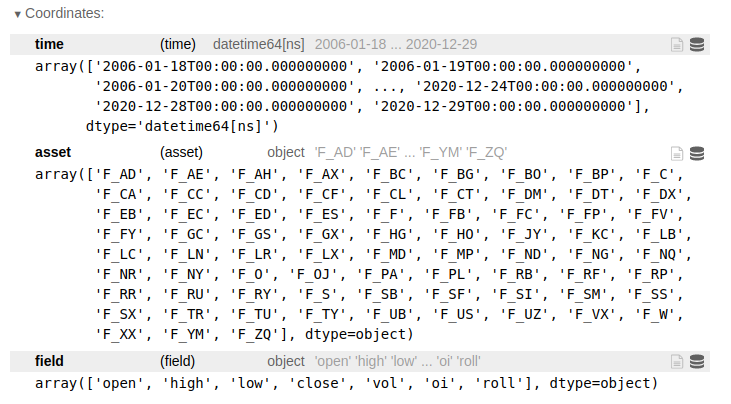
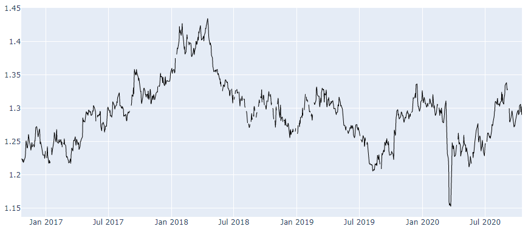

# Macroeconomic data

Quantiacs provides historical macroeconomic datasets. Currently the datasets from the [**U.S. Bureau of Labor Statistics**](https://www.bls.gov) are included. Statistics published by the Bureau of Labor Statistics include data about consumer prices, employment and unemployment, compensation and working conditions and productivity.

- [Bureau of Labor Statistics data](#bureau-of-labor-statistics)

----

## Bureau of Labor Statistics data

The [**U.S. Bureau of Labor Statistics**](https://www.bls.gov) is the principal agency for the U.S. government in the field of labor economics and statistics. It provides macroeconomic data in several interesting categories: prices, employment and unemployment, compensation and working conditions and productivity. Quantiacs has implemented these datasets on its cloud and makes them also available for local use on your machine. For more informations on using the Quantiacs toolbox and datasets offline, please read our [installation instructions](https://quantiacs.com/documentation/en/user_guide/local_development.html).

###  Loading the data
The information about available data can be obtained using:

```python
import pandas as pd
import qnt.data as qndata
dbs = qndata.blsgov.load_db_list()
display(pd.DataFrame(dbs))
```

which returns the list of datasets:


For each dataset an identifier, the name and the date of the last available update are displayed. Each dataset contains several time series which can be used as indicators. For example let us consider AP, Average consumer Prices (AP). They are calculated for household fuel, motor fuel, and food items from prices collected for the Consumer Price Index (CPI).

The time series contained in the AP dataset can be displayed using:

```python
series_list = list(qndata.blsgov.load_series_list('AP'))
display(pd.DataFrame(series_list).set_index('id'))
```

###  Using the Data

Suppose that we want to use in a strategy the data for the last 15 years. We can use:

```python
import qnt.data as qndata

futures_data = qndata.futures.load_data(tail = 365*15, dims = ("time", "field", "asset"))
```

The variable **futures_data** is an xarray.DataArray structure whose coordinates are: 

* **time**: a date in format yyyy-mm-dd;
* **field**: an attribute, for example the opening daily price;
* **asset**: the identifying symbol for the asset, for example **F_BP** for the British Pound/US Dollar ratio.




Specific fields can be extracted using:

```python
futures_open  = futures_data.sel(field="open")
futures_close = futures_data.sel(field="close")
futures_high  = futures_data.sel(field="high")
futures_low   = futures_data.sel(field="low")

volume_day    = futures_data.sel(field="vol")
open_interest = futures_data.sel(field="oi")

contracts_roll_over = futures_data.sel(field="roll")
```

| Data field | Description |
| ------------------ | -------- |
| open               | Opening daily price.|
| close              | Closing daily price. |
| high               | Highest daily price.|
| low                | Lowest daily price. |
| vol                | Daily trading volume (number of contracts).|
| oi                 | Total number of outstanding contracts.|
| roll              | Futures contract rollover information.|

Values for specific contracts can be obtained selecting the asset. Let us say that we are interested in British pound futures. We can get the close price as follows:

```python
GBP_USD = futures_data.sel(asset = 'F_BP').sel(field = 'close')
```

For visualizing the data we can use for example the plotly library [https://plotly.com/](https://plotly.com/):

```python
import plotly.graph_objs as go

trend_fig = [go.Scatter(
    x = GBP_USD.to_pandas().index,
    y = GBP_USD,
    line = dict(width=1, color='black'))]

fig = go.Figure(data = trend_fig)
fig.update_yaxes(fixedrange=False)
fig.show()
```



###  Using the BTC Futures

The Bitcoin Futures data for the last 8 years (history extended with Bitcoin spot price) can be loaded using:

```python
import qnt.data as qndata

btc_data = qndata.cryptofutures.load_data(tail = 365*8, dims = ("time", "field", "asset"))
```

### Front Contracts and Different Maturity Contracts

As several Futures contracts with the same underlying instrument but different expiration dates (maturities) are traded on financial exchange at the same time, we provide the option to load continuous front contracts (closest expiration date), next-to-front contracts (next-to-closest expiration date) and next-to-next-to-front contracts (next-to-next-to-closest expiration date):

```python
front_data                 = qndata.futures.load_data(min_date="1900-01-01", offset=0)
next_to_front_data         = qndata.futures.load_data(min_date="1900-01-01", offset=1)
next_to_next_to_front_data = qndata.futures.load_data(min_date="1900-01-01", offset=2)
```
Note that the default choice (no offset specified) selects front contracts. All three options are continuous contracts, obtained by patching together the single Futures contracts.

All three continuos contracts can be used as indicators, but only the front contracts will be used for the backtesting and real trading.
