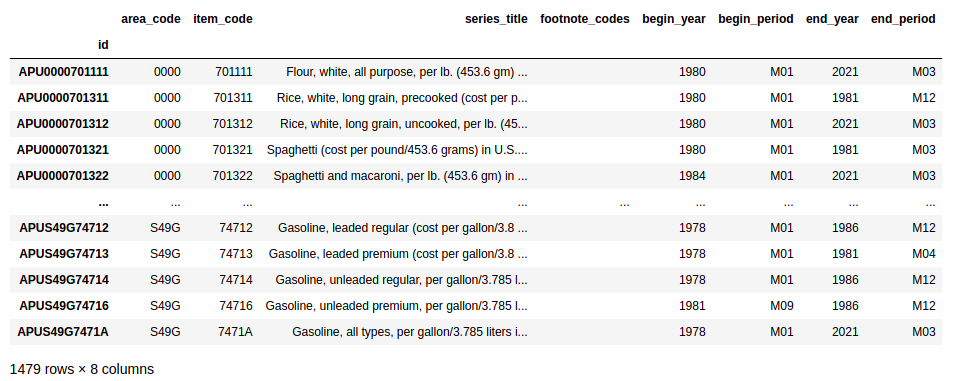
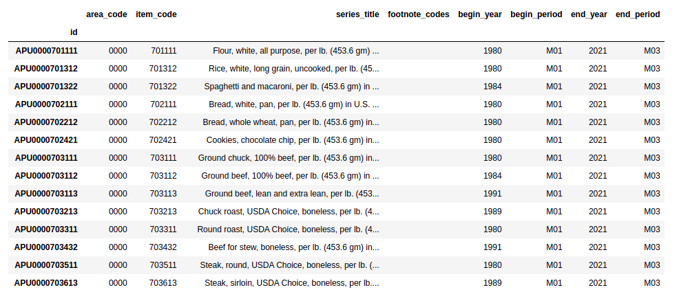

# Macroeconomic data

Quantiacs provides historical macroeconomic datasets. Currently the datasets from the [**U.S. Bureau of Labor Statistics**](https://www.bls.gov) are included. Statistics published by the Bureau of Labor Statistics include data about consumer prices, employment and unemployment, compensation and working conditions and productivity.

- [Bureau of Labor Statistics data](#bureau-of-labor-statistics)

----

## Bureau of Labor Statistics data

The [**U.S. Bureau of Labor Statistics**](https://www.bls.gov) is the principal agency for the U.S. government in the field of labor economics and statistics. It provides macroeconomic data in several interesting categories: prices, employment and unemployment, compensation and working conditions and productivity. Quantiacs has implemented these datasets on its cloud and makes them also available for local use on your machine. For more informations on using the Quantiacs toolbox and datasets offline, please read our [installation instructions](https://quantiacs.com/documentation/en/user_guide/local_development.html).

###  Loading the data
The information about available data can be obtained using:

```python
import pandas as pd
import qnt.data as qndata
dbs = qndata.blsgov.load_db_list()
display(pd.DataFrame(dbs))
```

which returns the list of datasets:


For each dataset an identifier, the name and the date of the last available update are displayed. Each dataset contains several time series which can be used as indicators. For example let us consider AP, Average consumer Prices (AP). They are calculated for household fuel, motor fuel, and food items from prices collected for the Consumer Price Index (CPI).

The time series contained in the AP dataset can be displayed using:

```python
series_list = list(qndata.blsgov.load_series_list('AP'))
display(pd.DataFrame(series_list).set_index('id'))
```

which returns:



For inspecting the metadata we refer to the template we made available at our GitHub page [here](https://github.com/quantiacs/strategy-futures-bls/blob/master/strategy.ipynb) and in your user space in the Examples section.

###  Preprocessing the data

Macroeconomic data should be preprocessed. Let us continue with the previous example. We can select global data for the U.S. selecting the associated area code as follows:

```python
us_series_list = [s for s in series_list if s['area_code'] == '0000']
display(pd.DataFrame(us_series_list).set_index('id'))
```

and later selecting global U.S. time series which are more relevant for forecasting global financial markets. Let us select time series which are currently being updated and have at least 20 years of history:

```python
actual_us_series_list = [s for s in us_series_list if s['begin_year'] <= '2000' and s['end_year'] == '2021' ]
display(pd.DataFrame(actual_us_series_list).set_index('id'))
```
The preprocessing leads to a subset of interesting time series:



Finally, single time series can be loaded using for example (we consider fuel oil):

```python
series_data = qndata.blsgov.load_series_data('APU000072511', tail = 30*365)

# convert to pandas.DataFrame
series_data = pd.DataFrame(series_data)
series_data = series_data.set_index('pub_date')

# remove yearly average data
series_data = series_data[series_data['period'] != 'M13']

series_data
```
