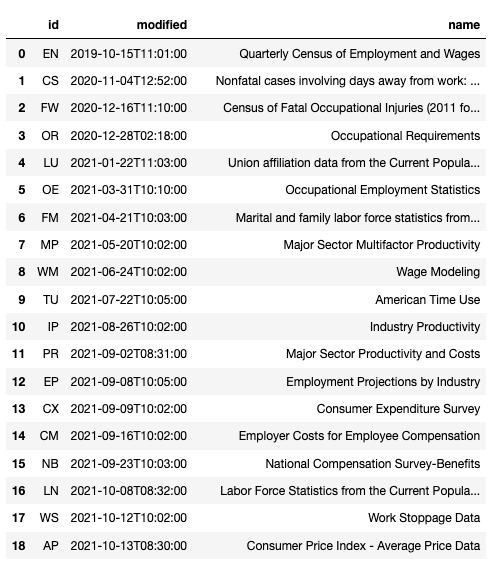
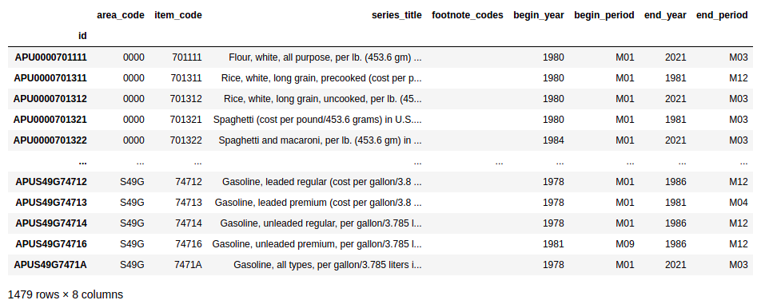
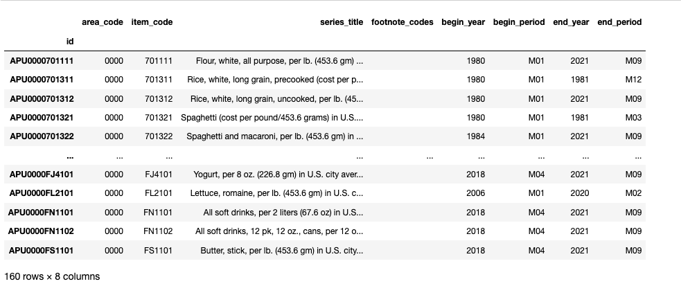
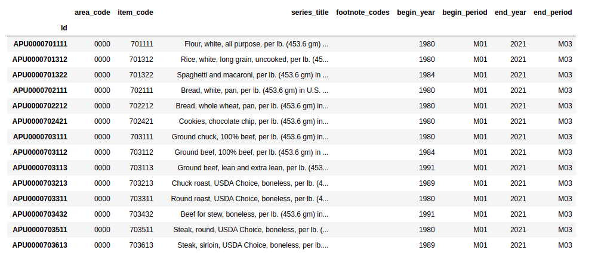
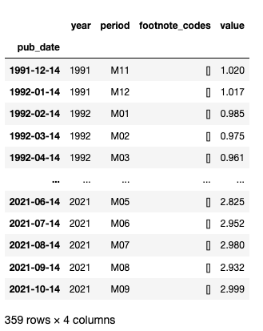

# Macroeconomic data

Quantiacs provides historical macroeconomic datasets. Currently datasets from the [**U.S. Bureau of Labor Statistics**](https://www.bls.gov) are included, covering consumer prices, employment and unemployment, compensation, working conditions, and productivity.

- [Bureau of Labor Statistics data](#bureau-of-labor-statistics)

----

## Bureau of Labor Statistics data

The [**U.S. Bureau of Labor Statistics**](https://www.bls.gov) is the main U.S. government agency for labor economics and statistics. It publishes macroeconomic data on prices, employment and unemployment, compensation, working conditions, and productivity. Quantiacs hosts these datasets on its cloud and also makes them available for local use. For more on using the Quantiacs toolbox offline, see the [local installation instructions](https://quantiacs.com/documentation/en/user_guide/local_development.html).

----


###  Loading the data
To see what data is available:

```python
import pandas as pd
import qnt.data as qndata
dbs = qndata.blsgov.load_db_list()
display(pd.DataFrame(dbs))
```

which returns the list of datasets:



Each dataset shows an identifier, a name, and the date of the last update. Each dataset contains several time series that can be used as indicators. For example, AP (Average Consumer Prices) covers household fuel, motor fuel, and food items from prices collected for the Consumer Price Index.

The time series contained in the AP dataset can be displayed using:

```python
series_list = list(qndata.blsgov.load_series_list('AP'))
display(pd.DataFrame(series_list).set_index('id'))
```

which returns:



To inspect the metadata, see the template on our [GitHub page](https://github.com/quantiacs/strategy-futures-bls/blob/master/strategy.ipynb) or in the Examples section of your user space.

----

###  Preprocessing the data

Macroeconomic data should be preprocessed. Continuing with the previous example, we can select global U.S. data by its area code:

```python
us_series_list = [s for s in series_list if s['area_code'] == '0000']
display(pd.DataFrame(us_series_list).set_index('id'))
```


and later selecting global U.S. time series which are more relevant for forecasting global financial markets. Let us select time series which are currently being updated and have at least 20 years of history:

```python
actual_us_series_list = [s for s in us_series_list if s['begin_year'] <= '2000' and s['end_year'] == '2021' ]
display(pd.DataFrame(actual_us_series_list).set_index('id'))
```
The preprocessing leads to a subset of interesting time series:



Finally, single time series can be loaded using for example (we consider fuel oil):

```python
series_data = qndata.blsgov.load_series_data('APU000072511', tail = 30*365)

# convert to pandas.DataFrame
series_data = pd.DataFrame(series_data)
series_data = series_data.set_index('pub_date')

# remove yearly average data
series_data = series_data[series_data['period'] != 'M13']

series_data
```


