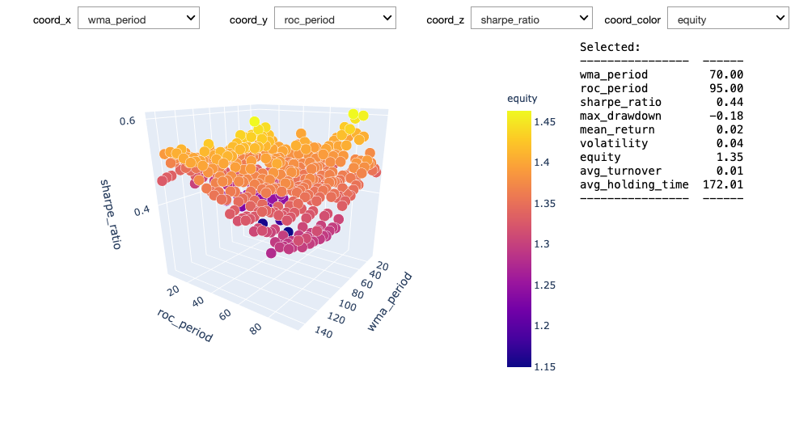

# Optimization

Backesting a trading system amounts to perform a simulation of the trading rules on historical data. All trading rules depend to some extent on a set of parameters. These parameters can be for example the lookback periods used for defining technical indicators or the hyperparameters of a complex machine learning model.

## Single-pass Strategy Example

Imagine a single-pass strategy where all data is accessed at once. This implementation is very fast and will speed up the parametric scan.

*You should make sure that your strategy is not implicitly forward looking before submission, see how to [prevent forward looking](https://quantiacs.com/documentation/en/user_guide/functional_quality.html#multi-pass-backtesting).*

The strategy is going long only when the rate of change in the last **roc_period** trading days (in this case 10) of the linear-weighted moving average over the last **wma_period** trading days (in this case 20) is positive.
```python
import qnt.data as qndata
import qnt.ta as qnta
import qnt.output as qnout
import qnt.stats as qns
import qnt.log as qnlog

import xarray as xr

def single_pass_strategy(data, wma_period=20, roc_period=10):
    wma = qnta.lwma(data.sel(field='close'), wma_period)
    sroc = qnta.roc(wma, roc_period)
    weights = xr.where(sroc > 0, 1, 0)
    weights = weights / len(data.asset) # normalize weights so that sum=1, fully invested
    with qnlog.Settings(info=False, err=False): # suppress log messages
        weights = qnout.clean(weights, data) # check for problems
    return weights
```

We recommend optimizing your strategy in a separate notebook than the one you want to submit, as parametric scan is very time consuming.

*Alternatively it is possible to mark the cells which perform scans using the **#DEBUG#** tag. When you submit your notebook, the backtesting engine which performs the evaluation on the Quantiacs server will skip these cells.*

We call the function **optimize_strategy**, which runs a parametric scan over pre-defined ranges of arguments for our strategy (in this case **single_pass_strategy**). In our example the arguments are **wma_period** and **roc_period**. The function **full_range_args_generator** generates all possible combinations of arguments in the specified (min, max, step) range.

So basically **optimize_strategy** executes **single_pass_strategy** with mutliple possible arguments and stores the results.

```Python
#DEBUG#
# evaluator will remove all cells with this tag before evaluation

import qnt.optimizer as qnop

data = qndata.futures.load_data(min_date='2004-01-01') # indicators need warmup, so prepend data

result = qnop.optimize_strategy(
    data,
    single_pass_strategy,
    qnop.full_range_args_generator(
        wma_period=range(10, 150, 5), # min, max, step
        roc_period=range(5, 100, 5)   # min, max, step
    ),
    workers=1 # you can set more workers when you run this code on your local PC to speed it up
)
```
When you work locally, you can use **workers > 1** to speed up the process by using parallelization. Use **workers=os.cpu_count()** for optimal performance.

**build_plot(result)** constructs an interactive chart of the results (statistical indicators) depending on the chosen tuple of arguments:

```Python
import qnt.optimizer as qnop

qnop.build_plot(result) # interactive chart in the notebook
```


As a reference, we display the iteration with the highest score (Sharpe ratio):

```python
print("Best iteration:")
display(result['best_iteration'])
```
```Python
Best iteration:

{'args': {'wma_period': 20, 'roc_period': 80},
 'result': {'equity': 1.454357413490685,
  'relative_return': -0.0022028115784406,
  'volatility': 0.03950151054490127,
  'underwater': -0.0033983347177664047,
  'max_drawdown': -0.1211117497323877,
  'sharpe_ratio': 0.5816109271207632,
  'mean_return': 0.022974510170690632,
  'bias': 1.0,
  'instruments': 71.0,
  'avg_turnover': 0.015183419860354838,
  'avg_holding_time': 87.05269121813073},
 'weight': 0.5816109271207632,
 'exception': None}
```

The arguments for the iteration with the highest score (Sharpe ratio) can be later defined manually or by calling **result['best_iteration']['args']** for the final strategy. Note that cells with the tag **#DEBUG#** are disabled.

A final multi-pass call backtest for the optimized strategy with the desired parameters would be:

```Python
import qnt.backtester as qnbt

best_args = {'wma_period': 20, 'roc_period': 80}
# or: best_args = result['best_iteration']['args']

def best_strategy(data):
    return single_pass_strategy(data, **best_args).isel(time=-1)

weights = qnbt.backtest(
    competition_type="futures",
    lookback_period=2 * 365,
    start_date='2006-01-01',
    strategy=best_strategy,
    analyze=True,
    build_plots=True
)
```

*Note: A parameter choice which maximizes the value of the Sharpe ratio when the simulation is performed on the past data is a source of backtest overfitting and can lead to poor performance on live data.*

## Optimizer Function


**Function**

```python
import qnt.optimizer as qnop

qnop.optimize_strategy(
    data,
    strategy,
    argument_generator,
    stats_function=None,
    stats_to_weight=None,
    workers=1
)
```

**Parameters**

|Parameter|Explanation|
|---|---|
|data|xarray.DataArray with input data.|
|strategy|strategy function, accepts data and other parameters and returns weights for all assets for the last day.|
|argument_generator| [argument generator](#argument-genertors) for additional arguments for strategy function|
|stats_function| calculate statistics for one pass (defaults to calculate all statistics seen below) (see [Stats Function](#stats-function))|
|stats_to_weight| converts statistics to weight in order to select the best iteration (defaults to weight is sharpe ratio)|
|workers|amount of processes to spawn for parallelization (try: workers=os.cpu_count() )|

If you want to optimize over something different than Sharpe Ratio, you would need to pass a stats_to_weight function as a parameter to **optimize_strategy**. See [Stats to Weight](#stats-to-weight) to see how such a function can be implemented.

**Output**

The function returns a dictionary with performance metrics and weight for each parameter tuple tried ('iterations'), as well as the best result (highest weight) ('best_iteration'). :

```Python
{'iterations': [{'args': {'wma_period': 10, 'roc_period': 5},
   'result': {'equity': 1.150857800857179,
    'relative_return': -0.0005426066585509925,
    'volatility': 0.040316492756790695,
    'underwater': -0.006563103714664287,
    'max_drawdown': -0.1280956832093425,
    'sharpe_ratio': 0.22026220205338382,
    'mean_return': 0.008880199473680017,
    'bias': 1.0,
    'instruments': 71.0,
    'avg_turnover': 0.07616475561830197,
    'avg_holding_time': 13.492355016737367},
   'weight': 0.22026220205338382,
   'exception': None},
   ...],
   'best_iteration': {'args': {'wma_period': 20, 'roc_period': 80},
  'result': {'equity': 1.461222328612549,
   'relative_return': 0.0018561181085214873,
   'volatility': 0.04026537419444597,
   'underwater': -0.003009583352372447,
   'max_drawdown': -0.12108332730734217,
   'sharpe_ratio': 0.5998114103212379,
   'mean_return': 0.024151630882683017,
   'bias': 1.0,
   'instruments': 71.0,
   'avg_turnover': 0.01518981991802005,
   'avg_holding_time': 87.11481900452533},
  'weight': 0.5998114103212379,
  'exception': None}}
   ```

Use
```Python
import qnt.optimizer as qnop

result = qnop.optimize_strategy(
    data,
    strategy,
    argument_generator,
    workers=1
)

qnop.build_plot(result)
```
for an interactive chart of the result

### Stats function

If you want different statistics than the stadard metrics you need to design a function with this skeleton and provide it as input parameter to **optimize_strategy** (example: **stats_function=stats_function**):
```Python
def stats_function(data, output):
    """
    Calculates statistics for the iteration output.
    :param data: market data
    :param output: weights
    :return: dictionary of statisctics
    """
```


### Stats to weight

If you for example want to optimize over Equity instead of Sharpe Ratio, you can define a function:
```Python
import math
def stats_to_weight_equity(stat):
    """
    Converts the statistics to weight.
    :param stat: dictionary of statistics
    """
    res = stat.get('equity', float('-inf')) #instead of 'equity' you can choose any metric
                                            #returned by the used stats_function
    if math.isfinite(res):
        return res
    else:
        return float('-inf')
```
and then pass that function to **optimize_strategy** (example: **stats_to_weight=stats_to_weight_equity**)


### Argument generators

Some examples
```python
qnop.full_range_args_generator( #all possible combinations
    wma_period=range(10, 150, 5), # min, max, step
    roc_period=range(5, 100, 5)   # min, max, step
)
qnop.random_range_args_generator( #random distributed combinations
    100,                       # number of samples
    wma_period=range(10, 150), # min, max
    roc_period=range(5, 100)   # min, max
)
```
