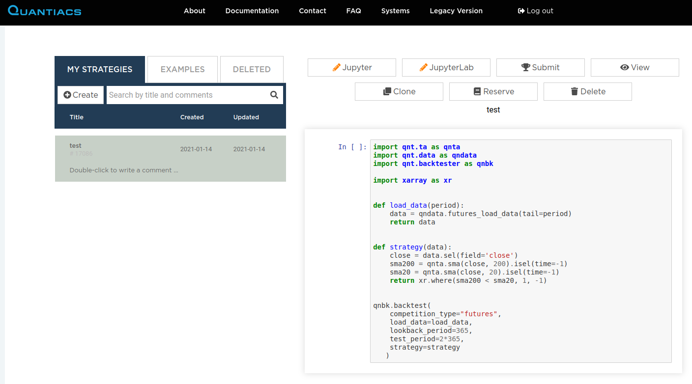
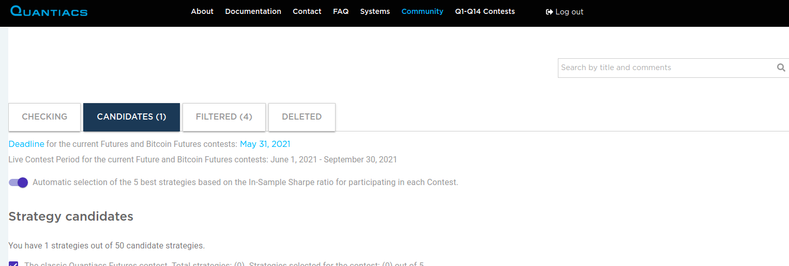

# Competition filters

For submitting a strategy to a contest you have to click on the **Submit** button in your **Development** area:



You can also submit code directly from your developing environment in Jupyter Notebook or JupyterLab.   

After submission your code will be checked on our servers and its status will appear in the **Competition** section of your account under the tab **Checking**:




Your algorithm will be admitted to the Contest if it passes checks (filters). In case of success you will find your code under the **Candidates** tab. Otherwise it will be listed under the **Filtered** tab where you will be able to inspect the logs and determine the reason for the error.

## Technical filters

### Source file must exist
An error message stating that the **strategy.ipynb** file was not found is connected to a non-standard name for the file containing your strategy. This file must be named **strategy.ipynb**.

### Execution failed
If you see an error message stating that the execution of **strategy.ipynb** failed, then you should check the logs as they will contain the necessary information.

> You should check the logs (**server logs** and **html** columns) as they will contain the necessary information.

Pay special attention to the dates in the logs: you can use this information to reproduce the problem in the **precheck.ipynb** file you find in your root directory. Substitute these **dates** when calling **evaluate_passes**.

### Weights must be written
If you see an error message stating that the calling to the **write_output** function is skipped (example **Missed call to write_output**), then your strategy does not save the final weights. Your last call in the **strategy.ipynb** file should be **qnt.output.write(weights)** (or **qnt.backtest(...)** if you use Multi-Pass Backtesting), assuming that you used **weights** for the final allocation weights.
```python
qnt.output.write(weights)
```

### All data must be loaded
An error message stating that data are loaded only until a certain day is due to the fact that you are loading the data cropping the number of days. Do not crop data when you submit, as your system needs to run on a daily basis on new data.

Error:
```python
qndata.futures.load_data(min_date="2006-01-01", max_date="2008-01-01")
```

Solution

```python
qndata.futures.load_data(min_date="2006-01-01")
```

### Weights must be generated for all trading days
An error message stating that the strategy does not display weights for all trading days means that weights for some days are not generated, for example because of a **drop** operation. This problem can be avoided using the function **qnt.output.check(weights, data, "futures")**, assuming that you are working with futures and you are generating **weights** on **data**.

### Weights are not generated at the beginning of the time series
Your strategy should generate non-vanishing weights at least since the start date of the corresponding contest:

* Futures Contest - The strategy must trade from January 1, 2006.

* Bitcoin Futures - The strategy must trade from January 1, 2014.

* Crypto Top-10 Long - The strategy must trade from January 1, 2014.

Check in your strategy code the following:

* The range of data you are loading. Specify the required period as:
```python
futures = qndata.futures.load_data(min_date="2006-01-01")
```
* The range of data you are saving:
```python
display(weights)
qnt.output.write(weights)
```

The calculation period for the Sharpe ratio starts from the date when the first non-zero weights are encountered. If, for example, your algorithm only generates weights on the Bitcoin Futures since January 1, 2017, then it will **not** be accepted as the In-Sample period will be effectively too short.

This error often occurs when using technical analysis indicators which need a warm-up period.
Check the date using:
```python
min_time = weights.time[abs(weights).fillna(0).sum('asset')> 0].min()
min_time
```
The return value should be the same or larger than the starting date specified in the rules for a particular type of competition.

If **min_time** is larger than the starting date, we recommend to fill the starting values of the time series with non-vanishing values, for example a simple buy-and-hold strategy.
```python
min_time = weights.time[abs(weights).fillna(0).sum('asset')> 0].min()
weights_new = xr.where(weights.time < min_time, 1, weights)
```

More details about the calculation mechanism can be found in the source code of the library, method ***qnt.output.calc_sharpe_ratio_for_check***.

### Timeout
An error message stating that the strategy calculation exceeds a given time implies that you need to optimize the code and reduce the execution time. Futures systems should be evaluated in 10 minutes and Bitcoin futures/Crypto long systems in 5 minutes of time.


### Number of strategies
An error message stating that the limit for strategies has been exceeded is connected to the number of running strategies in your area. You can have at most 50 of them and you should select 5 for the contest.

### Sharpe ratio
A warning stating that the Sharpe ratio is smaller than 1 means that the risk-adjusted performance of your system in the In-Sample period is too low and it should be improved. Your system will be evaluated on a daily basis, but **it will NOT be eligile for a prize**.

> We recommend that you familiarize yourself with [how to find the optimal parameters for strategies](https://quantiacs.com/documentation/en/examples/trading_system_optimization.html).

You should be careful with **forward-looking**. If you see that the notebook delivers a Sharpe ratio larger than 1, but the backtester not, then most likely you are looking into the future, for example by taking a global mean.

> We **recommend** testing the strategy in **multi-pass** mode. [Example](https://quantiacs.com/documentation/en/examples/trading_system_optimization.html#preventing-forward-looking).

## Templates
A copy of a template **will NOT be eligible for a prize**.
