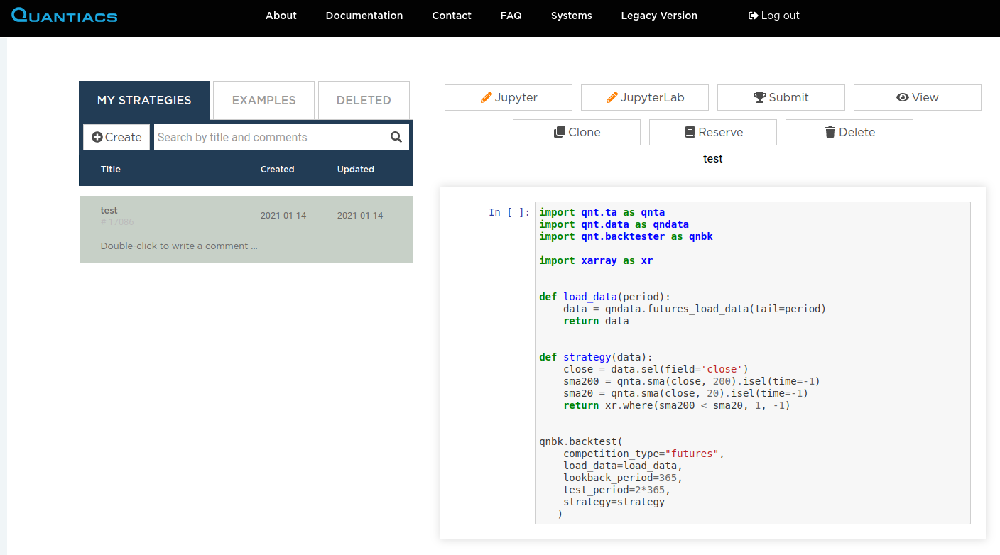
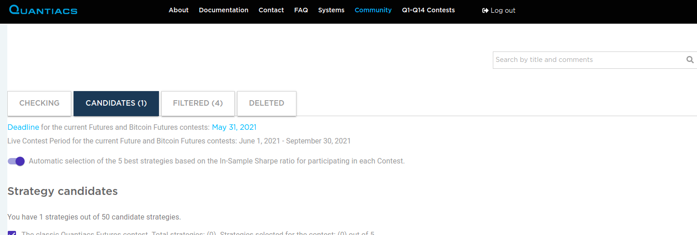

# Competition filters

To submit a strategy to the contest, click the **Submit** button in your **Development** area:



You can also submit code directly from your development environment in Jupyter Notebook or JupyterLab.

After submission, our servers check your code. The status appears in the **Competition** section of your account, under the **Checking** tab:



If your algorithm passes these checks (filters), it is admitted to the Contest and appears under the **Candidates** tab. If it fails, it is listed under the **Filtered** tab, where you can inspect the logs to see what went wrong.

## Technical filters

### Sharpe ratio

**1) Not eligible for contest: in-sample Sharpe must be larger than 0.7**

The Sharpe Ratio measures risk-adjusted performance. A warning that the Sharpe ratio is below 0.7 means your strategy's In-Sample performance, adjusted for risk, is too low.

You should improve your algorithm. Here are some examples to look at:

* [Trading System Optimization](https://github.com/quantiacs/strategy-futures-ta-global-optimizer/blob/master/strategy.ipynb)
* [Trading System Optimization by Asset](https://github.com/quantiacs/strategy-futures-optimization-each-asset/blob/master/strategy.ipynb)
* [A Strategy Using Technical Analysis Indicators](https://github.com/quantiacs/strategy-predict-NASDAQ100-use-atr-lwma/blob/master/strategy.ipynb)
* [Getting a List of the Top 3 Assets Ranked by Sharpe Ratio in Q20 Quick Start](https://github.com/quantiacs/strategy-q20-nasdaq100-quick-start/blob/master/strategy.ipynb)

**2) Difference in in-sample Sharpe ratio in Jupyter or JupyterLab compared to the contest page**

Watch out for **forward-looking bias**. If your notebook shows a Sharpe ratio above 0.7 but the backtester does not, you are most likely using future data, for instance by calculating a global mean.

> You can run the following notebook to check for this common mistake:
[Quantiacs Toolbox Precheck](https://github.com/quantiacs/toolbox/blob/main/qnt/precheck.ipynb)

Common mistakes to watch for:

* Using future knowledge in the past
* Understanding the Advance/Decline Line and the Advance/Decline Ratio
* Ensuring that standardization in price processing does not incorporate knowledge from the future to the past
* Understanding Quantiles

More information:
* [Different Sharpe Ratios for Multipass-Backtest and Quantiacs Multipass Backtest](https://quantiacs.com/community/topic/374/different-sharpe-ratios-for-multipass-backtest-and-quantiacs-mulipass-backtest?_=1687248669560)

We **recommend** testing your strategy in **multi-pass** mode. [Here is an example](https://quantiacs.com/documentation/en/examples/trading_system_optimization.html#preventing-forward-looking).

### Source file must exist
An error saying **strategy.ipynb** was not found means your strategy file has a non-standard name. It must be named **strategy.ipynb**.

### Execution failed
If **strategy.ipynb** fails to execute, check the logs (server logs and html columns) for details on what went wrong.

Pay special attention to the dates in the logs: you can use this information to reproduce the problem in the **precheck.ipynb** file you find in your root directory. Substitute these **dates** when calling **evaluate_passes**.

### Weights must be written
If you see **Missed call to write_output**, your strategy is not saving the final weights. The last call in **strategy.ipynb** should be **qnt.output.write(weights)** (or **qnt.backtest(...)** if you use multi-pass backtesting), assuming **weights** holds your final allocation.
```python
qnt.output.write(weights)
```

### All data must be loaded
An error saying data is loaded only until a certain day means you are cropping the date range. Do not crop data when you submit, because your system needs to run daily on new data.

Error:
```python
qndata.futures.load_data(min_date="2006-01-01", max_date="2008-01-01")
```

Solution

```python
qndata.futures.load_data(min_date="2006-01-01")
```

### Weights must be generated for all trading days
An error saying the strategy does not have weights for all trading days means weights for some days are missing, for example because of a **drop** operation. Avoid this by using **qnt.output.check(weights, data, "futures")** (assuming you are working with futures and generating **weights** on **data**).

### Weights are not generated at the beginning of the time series
Your strategy must produce non-zero weights from the start date defined for each contest:

* NASDAQ-100 Contest - Trading should begin from January 1, 2006.
* Futures Contest - Trading should begin from January 1, 2006.
* Bitcoin Futures - Trading should start from January 1, 2014.
* Crypto Top-10 Long - Trading should commence from January 1, 2014.

Review your strategy code:

1. Verify the data range being loaded. Define the appropriate time frame as follows:
   ```python
   futures = qndata.futures.load_data(min_date="2006-01-01")
   ```
2. Ensure the data range being saved:
    ```python
    display(weights)
    qnt.output.write(weights)
    ```

The Sharpe ratio computation starts from the date of the first non-zero weights. If your algorithm starts generating weights on Bitcoin Futures from January 1, 2017, it will **not** be accepted because the In-Sample period is too short.

This often happens when technical analysis indicators need a warm-up period. You can check the date with:

```python
min_time = weights.time[abs(weights).fillna(0).sum('asset')> 0].min()
min_time
```

> The value of min_time should be equal to or later than the starting date specified in the rules for the respective competition.

If min_time is later than the starting date, it's recommended to fill the starting values of the time series with non-zero values. For instance, you could use a simple buy-and-hold strategy.

```python
def get_enough_bid_for(data_, weights_):
    time_traded = weights_.time[abs(weights_).fillna(0).sum('asset') > 0]
    is_strategy_traded = len(time_traded)
    if is_strategy_traded:
        return xr.where(weights_.time < time_traded.min(), data_.sel(field="is_liquid"), weights_)
    return weights_


weights_new = get_enough_bid_for(data, weights)
weights_new = weights_new.sel(time=slice("2006-01-01",None))
```

For details on the calculation method, see the source code in qnt.output.calc_sharpe_ratio_for_check.

### Timeout
An error saying the strategy calculation exceeds the time limit means you need to optimize your code. Futures systems must finish within 10 minutes, and Bitcoin futures/Crypto long systems within 5 minutes.


### Number of strategies
An error about the strategy limit means you have too many running strategies. You can have at most 50, and you should select 15 for the contest.

### Templates
A copy of a template **will NOT be eligible for a prize**.
