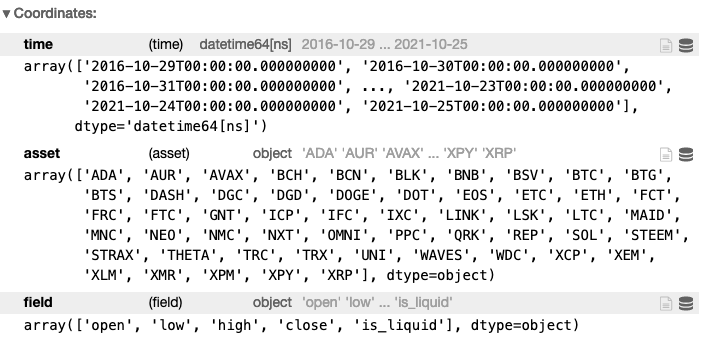
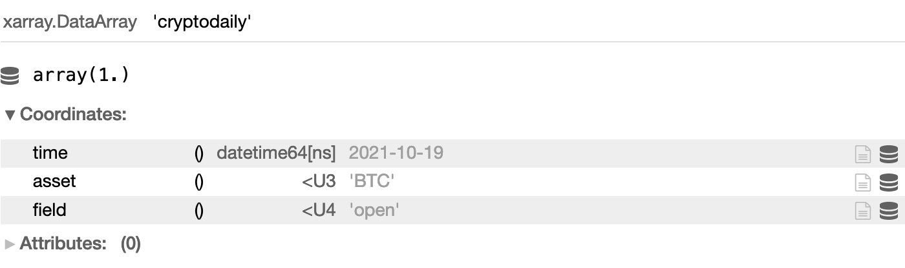
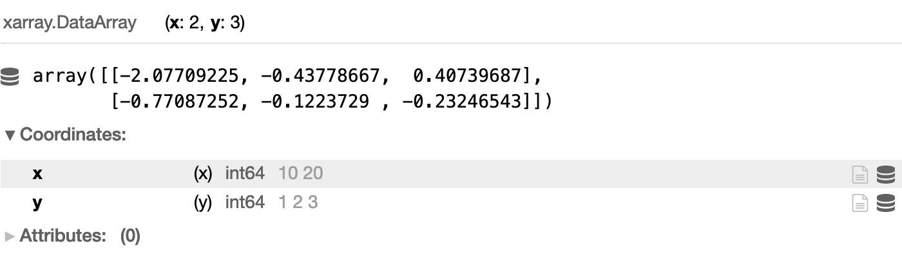

# Xarray
Here we give a short overview of important xarray features.

For a more detailed documentation on Xarray please go to [https://xarray.pydata.org/en/stable/](https://xarray.pydata.org/en/stable/) or [API-Reference xarray](https://quantiacs.com/documentation/en/reference/operators.html#xarray)

## Overview
Consider for example cryptocurrency daily data from the last 5 years:
```Python
import xarray as xr
import qnt.data as qndata

data = qndata.cryptodaily_load_data(tail=365*5)
```


**data** is an xarray.DataArray, a labelled multi-dimensional array whose key properties are:

* **values**: a numpy.ndarray holding the array’s values;
* **dims**: dimension names for each axis;
* **coords**: a dict-like container of arrays (coordinates) that label each point (e.g., 1-dimensional arrays of numbers, datetime objects or strings);
* **attrs**: a dict to hold arbitrary metadata (attributes).

in our example:

**data.values**
```Python
array([[[         nan, 2.061610e-01,          nan, ..., 5.890100e-02,
         2.744000e-03, 8.090000e-03],
        [         nan, 1.859190e-01,          nan, ..., 5.739400e-02,
         2.864000e-03, 7.870000e-03],
        [         nan, 1.579340e-01,          nan, ..., 5.947300e-02,
         2.814000e-03, 8.240000e-03],
        ...],
        ...,
        [[1.000000e+00,          nan, 1.000000e+00, ..., 0.000000e+00,
         0.000000e+00, 1.000000e+00],
        [1.000000e+00,          nan, 1.000000e+00, ..., 0.000000e+00,
         0.000000e+00, 1.000000e+00],
        [1.000000e+00,          nan, 1.000000e+00, ..., 0.000000e+00,
         0.000000e+00, 1.000000e+00]]])
```

**data.dims**
```Python
('field', 'time', 'asset')
```

**data.coordinates**:




## Indexing

* via integer:

```python
data.isel(time=-1) #read only
data[dict(time=-1)] #also assignment
```
* via label:

```python
data.sel(asset='BTC') #read only
da.loc[dict(asset='BTC')] #also assignment
```

Example:
```python
data.loc[{'time':'2021-10-19','asset':'BTC','field':'open'}] = 1

data.sel(time='2021-10-19').sel(asset='BTC').sel(field='open')
```


## Functions
A few important xarray functions:

* **new xarray.DataArray with same shapes and dimensions but every value is 0. :**

```python
xr.zeros_like(data)
```

* **create xarray.DataArray from scratch**

```Python
data = xr.DataArray(np.random.randn(2, 3), dims=('x', 'y'), coords={'x': [10, 20],'y':[1,2,3]})
data
```


* **xr.where(cond, x, y)** *: When cond is True, return values from x, otherwise returns values from y* (x or y can also be scalars)

```Python
x = xr.DataArray(0.1 * np.arange(10))
#<xarray.DataArray>
#array([0. , 0.1, 0.2, 0.3, 0.4, 0.5, 0.6, 0.7, 0.8, 0.9])

xr.where(x < 0.5, x, x * 100)
#<xarray.DataArray>
#array([ 0. ,  0.1,  0.2,  0.3,  0.4, 50. , 60. , 70. , 80. , 90. ])

xr.where(x < 0.5, 0, 1)
#<xarray.DataArray>
#array([ 0. ,  0.,  0,  0.,  0., 1. , 1. , 1. , 1. , 1. ])
```
